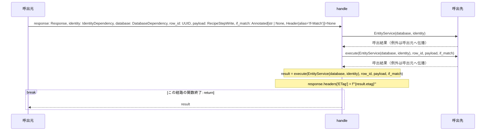
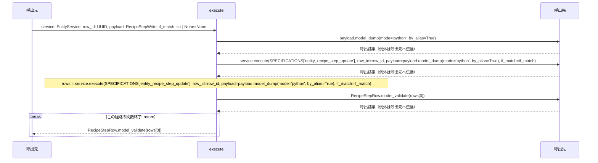
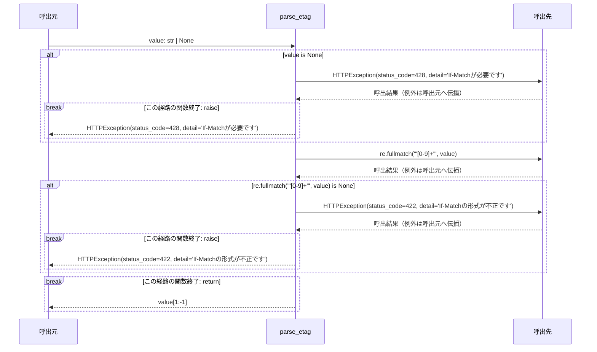
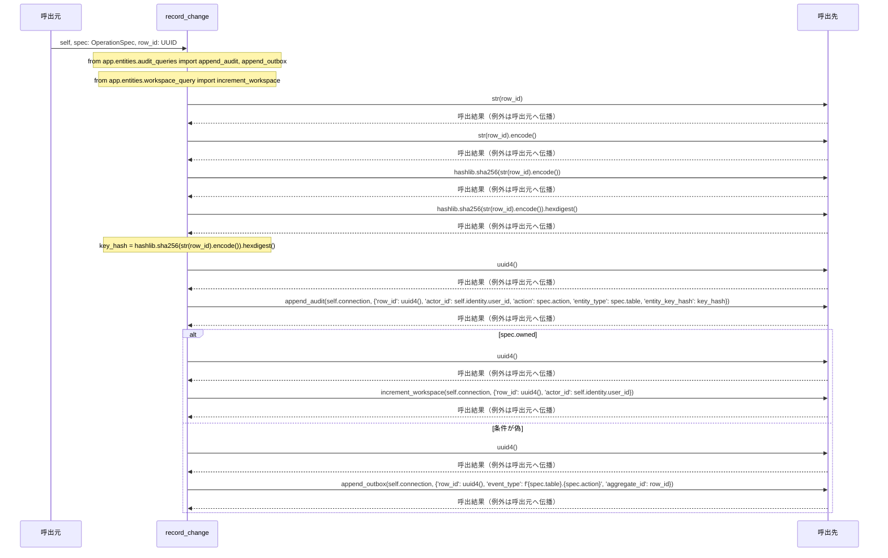

# シーケンス: entity_recipe_step_update

[詳細](detail.md) / [入出力](interface.md) / [ログ](messages.md) / [SQL](queries.md) / [シーケンス](sequence.md) / [要因別試験](tests.md) / [API一覧](../../README.md)

実装から自動生成。手編集禁止。`uv run python tools/generate_service_design.py` で更新。

対象はrouter.py・functions.pyの各関数。呼出元・関数・呼出先の3者で、関数内の分岐と反復を示す。関数間を推測で展開せず、呼出先の名前をそのまま記載する。内包表記・短絡評価は条件付き式のまま残す。ローカル関数は字句スコープ付きの別図にし、関数定義と本文の実行を区別する。エンティティAPIは共有EntityServiceも含める。FastAPIの依存解決、middleware、DBドライバー内部はこの図の対象外。try/except/else/finallyとcontext境界を保持する。continue/breakは注記位置で該当経路を終了し、次の反復/ループ外へ進む。

### router.py: `handle`

定義元: `backend/src/app/apis/entities/recipe_step_update/router.py:32`

### functions.py: `execute`

定義元: `backend/src/app/apis/entities/recipe_step_update/functions.py:9`

### entity_service.py: `parse_etag`

定義元: `backend/src/app/core/entity_service.py:23`

### entity_service.py: `execute`

定義元: `backend/src/app/core/entity_service.py:39`

```mermaid
sequenceDiagram
    participant Caller as 呼出元
    participant Function as execute
    participant Callee as 呼出先
    Caller->>Function: self, spec: OperationSpec, payload: Mapping[str, Any] | None=None, row_id: UUID | None=None, if_match: str | None=None, limit: int=50, after: UUID | None=None
    Note over Function: 条件付き式を評価: not spec.owned and self.identity.role != #39;admin#39;
    alt not spec.owned and self.identity.role != #39;admin#39;
        Function->>Callee: logger.warning(#39;entity_operation_rejected#39;, extra={#39;operation_id#39;: spec.operation_id})
        Callee-->>Function: 呼出結果（例外は呼出元へ伝播）
        Function->>Callee: HTTPException(status_code=403, detail=#39;管理者権限が必要です#39;)
        Callee-->>Function: 呼出結果（例外は呼出元へ伝播）
        break この経路の関数終了: raise
            Function-->>Caller: HTTPException(status_code=403, detail=#39;管理者権限が必要です#39;)
        end
    end
    alt not 1 #60;= limit #60;= 100
        Function->>Callee: HTTPException(status_code=422, detail=#39;取得件数は1から100です#39;)
        Callee-->>Function: 呼出結果（例外は呼出元へ伝播）
        break この経路の関数終了: raise
            Function-->>Caller: HTTPException(status_code=422, detail=#39;取得件数は1から100です#39;)
        end
    end
    Note over Function: 条件付き式を評価: dict(payload or {})
    Note over Function: values = dict(payload or {})
    Function->>Callee: set(values)
    Callee-->>Function: 呼出結果（例外は呼出元へ伝播）
    Function->>Callee: set(spec.input_columns)
    Callee-->>Function: 呼出結果（例外は呼出元へ伝播）
    alt set(values) != set(spec.input_columns)
        Function->>Callee: HTTPException(status_code=422, detail=#39;入力項目が操作契約と一致しません#39;)
        Callee-->>Function: 呼出結果（例外は呼出元へ伝播）
        break この経路の関数終了: raise
            Function-->>Caller: HTTPException(status_code=422, detail=#39;入力項目が操作契約と一致しません#39;)
        end
    end
    Note over Function: 条件付き式を評価: spec.table == #39;app_user#39; and values.get(#39;auth_subject#39;, self.identity.subject) != self.identity.subject
    alt spec.table == #39;app_user#39; and values.get(#39;auth_subject#39;, self.identity.subject) != self.identity.subject
        Function->>Callee: HTTPException(status_code=403, detail=#39;認証主体は変更できません#39;)
        Callee-->>Function: 呼出結果（例外は呼出元へ伝播）
        break この経路の関数終了: raise
            Function-->>Caller: HTTPException(status_code=403, detail=#39;認証主体は変更できません#39;)
        end
    end
    Note over Function: 条件付き式を評価: #39;user_id#39; in values and str(values[#39;user_id#39;]) != str(self.identity.user_id)
    alt #39;user_id#39; in values and str(values[#39;user_id#39;]) != str(self.identity.user_id)
        Function->>Callee: HTTPException(status_code=403, detail=#39;別の利用者を指定できません#39;)
        Callee-->>Function: 呼出結果（例外は呼出元へ伝播）
        break この経路の関数終了: raise
            Function-->>Caller: HTTPException(status_code=403, detail=#39;別の利用者を指定できません#39;)
        end
    end
    Note over Function: 条件付き式を評価: {**values, #39;row_id#39;: row_id or uuid4(), #39;actor_id#39;: self.identity.user_id, #39;page_limit#39;: limit, #39;after_id#39;: after}
    Note over Function: params: dict[str, Any] = {**values, #39;row_id#39;: row_id or uuid4(), #39;actor_id#39;: self.identity.user_id, #39;page_limit#39;: limit, #39;after_id#39;: after}
    alt spec.action in {#39;update#39;, #39;delete#39;}
        Function->>Callee: parse_etag(if_match)
        Callee-->>Function: 呼出結果（例外は呼出元へ伝播）
        Note over Function: params[#39;expected_etag#39;] = parse_etag(if_match)
    end
    loop column in spec.json_columns
        Note over Function: 条件付き式を評価: column in params and params[column] is not None
        alt column in params and params[column] is not None
            Function->>Callee: to_jsonable_python(params[column])
            Callee-->>Function: 呼出結果（例外は呼出元へ伝播）
            Function->>Callee: Jsonb(to_jsonable_python(params[column]))
            Callee-->>Function: 呼出結果（例外は呼出元へ伝播）
            Note over Function: params[column] = Jsonb(to_jsonable_python(params[column]))
        end
    end
    loop column in spec.bigint_columns
        Note over Function: 条件付き式を評価: column in params and params[column] is not None
        alt column in params and params[column] is not None
            Function->>Callee: int(params[column])
            Callee-->>Function: 呼出結果（例外は呼出元へ伝播）
            Note over Function: params[column] = int(params[column])
        end
    end
    rect rgb(244, 247, 246)
    Note over Function: try: 例外発生時は一致するexceptへ移る
        Function->>Callee: self.connection.transaction()
        Callee-->>Function: 呼出結果（例外は呼出元へ伝播）
        Note over Function: context開始: self.connection.transaction()
        loop (column, query) in spec.reference_queries
            Function->>Callee: values.get(column)
            Callee-->>Function: 呼出結果（例外は呼出元へ伝播）
            Note over Function: value = values.get(column)
            Note over Function: 条件付き式を評価: value is not None and (not query(self.connection, {#39;reference_id#39;: value, #39;actor_id#39;: self.identity.user_id, #39;preview#39;: catalog_preview_enabled()}))
            alt value is not None and (not query(self.connection, {#39;reference_id#39;: value, #39;actor_id#39;: self.identity.user_id, #39;preview#39;: catalog_preview_enabled()}))
                Function->>Callee: HTTPException(status_code=403, detail=#39;参照先を利用できません#39;)
                Callee-->>Function: 呼出結果（例外は呼出元へ伝播）
                break この経路の関数終了: raise
                    Function-->>Caller: HTTPException(status_code=403, detail=#39;参照先を利用できません#39;)
                end
            end
        end
        Function->>Callee: spec.query(self.connection, params)
        Callee-->>Function: 呼出結果（例外は呼出元へ伝播）
        Note over Function: rows = spec.query(self.connection, params)
        Note over Function: 条件付き式を評価: not rows and spec.action in {#39;get#39;, #39;update#39;, #39;delete#39;}
        alt not rows and spec.action in {#39;get#39;, #39;update#39;, #39;delete#39;}
            Note over Function: 条件付き式を評価: 404 if spec.action == #39;get#39; else 409
            Note over Function: status = 404 if spec.action == #39;get#39; else 409
            Function->>Callee: HTTPException(status_code=status, detail=#39;対象がないか行の版が変わりました#39;)
            Callee-->>Function: 呼出結果（例外は呼出元へ伝播）
            break この経路の関数終了: raise
                Function-->>Caller: HTTPException(status_code=status, detail=#39;対象がないか行の版が変わりました#39;)
            end
        end
        loop row in rows
            Note over Function: 条件付き式を評価: spec.table == #39;recipe_embedding#39; and isinstance(row.get(#39;embedding#39;), str)
            alt spec.table == #39;recipe_embedding#39; and isinstance(row.get(#39;embedding#39;), str)
                Function->>Callee: json.loads(row[#39;embedding#39;])
                Callee-->>Function: 呼出結果（例外は呼出元へ伝播）
                Note over Function: row[#39;embedding#39;] = json.loads(row[#39;embedding#39;])
            end
            loop column in spec.bigint_columns
                Function->>Callee: row.get(column)
                Callee-->>Function: 呼出結果（例外は呼出元へ伝播）
                alt row.get(column) is not None
                    Function->>Callee: str(row[column])
                    Callee-->>Function: 呼出結果（例外は呼出元へ伝播）
                    Note over Function: row[column] = str(row[column])
                end
            end
        end
        alt spec.action in {#39;create#39;, #39;update#39;, #39;delete#39;}
            Function->>Callee: self.record_change(spec, params[#39;row_id#39;])
            Callee-->>Function: 呼出結果（例外は呼出元へ伝播）
        end
        Function->>Callee: len(rows)
        Callee-->>Function: 呼出結果（例外は呼出元へ伝播）
        Function->>Callee: logger.info(#39;entity_operation_completed#39;, extra={#39;operation_id#39;: spec.operation_id, #39;table#39;: spec.table, #39;action#39;: spec.action, #39;row_count#39;: len(rows)})
        Callee-->>Function: 呼出結果（例外は呼出元へ伝播）
        break この経路の関数終了: return
            Function-->>Caller: rows
        end
        Note over Function: context終了: return・例外時も終了処理
    end
    opt 例外: errors.IntegrityError
        Function->>Callee: logger.warning(#39;entity_operation_rejected#39;, extra={#39;operation_id#39;: spec.operation_id, #39;sqlstate#39;: exc.sqlstate})
        Callee-->>Function: 呼出結果（例外は呼出元へ伝播）
        Function->>Callee: HTTPException(status_code=409, detail=#39;参照・一意性・業務制約により保存できません#39;)
        Callee-->>Function: 呼出結果（例外は呼出元へ伝播）
        break この経路の関数終了: raise
            Function-->>Caller: HTTPException(status_code=409, detail=#39;参照・一意性・業務制約により保存できません#39;)
        end
    end
    opt 例外: errors.InsufficientPrivilege
        Function->>Callee: HTTPException(status_code=403, detail=#39;操作権限がありません#39;)
        Callee-->>Function: 呼出結果（例外は呼出元へ伝播）
        break この経路の関数終了: raise
            Function-->>Caller: HTTPException(status_code=403, detail=#39;操作権限がありません#39;)
        end
    end
    opt 例外: errors.SerializationFailure
        Function->>Callee: HTTPException(status_code=409, detail=#39;同時更新がありました。再取得してください#39;)
        Callee-->>Function: 呼出結果（例外は呼出元へ伝播）
        break この経路の関数終了: raise
            Function-->>Caller: HTTPException(status_code=409, detail=#39;同時更新がありました。再取得してください#39;)
        end
    end
```

### entity_service.py: `record_change`

定義元: `backend/src/app/core/entity_service.py:131`

