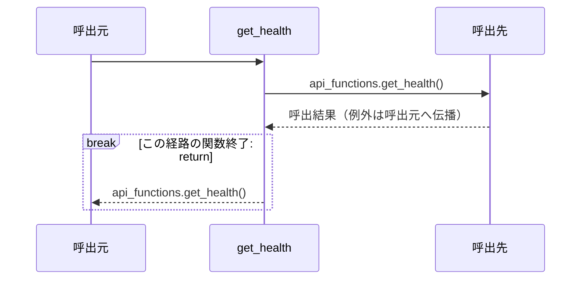
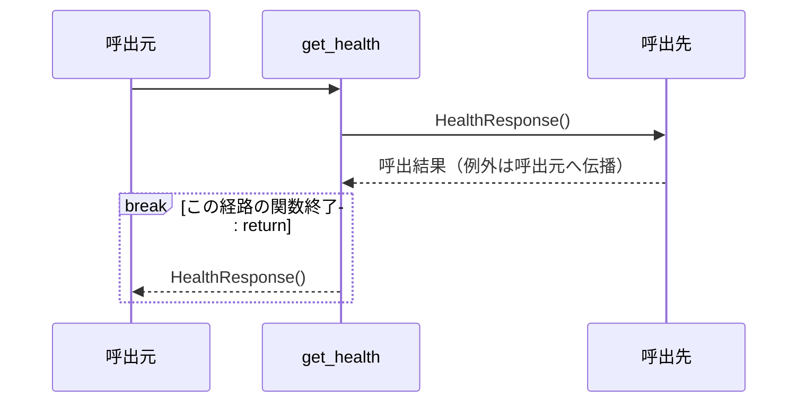

# シーケンス: get_health

実装から自動生成。手編集禁止。`uv run python tools/generate_service_design.py` で更新。

対象はrouter.py・functions.pyの各関数。呼出元・関数・呼出先の3者で、関数内の分岐と反復を示す。関数間を推測で展開せず、呼出先の名前をそのまま記載する。内包表記・短絡評価は条件付き式のまま残す。FastAPIの依存解決、middleware、連携ポートの実装内部はこの図の対象外で、詳細設計と定義元を参照する。continue/breakは注記位置で該当経路を終了し、次の反復/ループ外へ進む。

### router.py: `get_health`

定義元: `backend/src/app/apis/health/get_health/router.py:11`



#### 対応する実装

```python
@router.get(CONTRACT.path, operation_id=CONTRACT.operation_id, summary=CONTRACT.summary)
def get_health() -> HealthResponse:
    return api_functions.get_health()
```

### functions.py: `get_health`

定義元: `backend/src/app/apis/health/get_health/functions.py:4`



#### 対応する実装

```python
def get_health() -> HealthResponse:
    """AWSへの配備やカタログの網羅性を示唆せず、このAPIの状態を返す。"""
    return HealthResponse()
```
