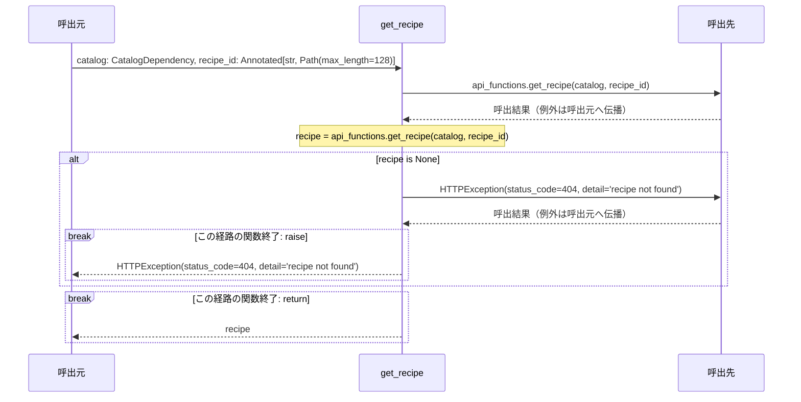
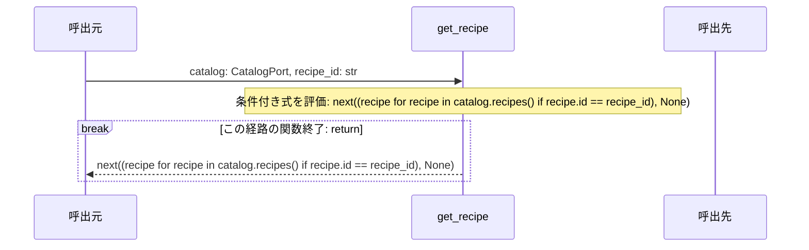

# シーケンス: get_recipe

実装から自動生成。手編集禁止。`uv run python tools/generate_service_design.py` で更新。

対象はrouter.py・functions.pyの各関数。呼出元・関数・呼出先の3者で、関数内の分岐と反復を示す。関数間を推測で展開せず、呼出先の名前をそのまま記載する。内包表記・短絡評価は条件付き式のまま残す。FastAPIの依存解決、middleware、連携ポートの実装内部はこの図の対象外で、詳細設計と定義元を参照する。continue/breakは注記位置で該当経路を終了し、次の反復/ループ外へ進む。

### router.py: `get_recipe`

定義元: `backend/src/app/apis/recipes/get_recipe/router.py:20`



#### 対応する実装

```python
@router.get(CONTRACT.path, operation_id=CONTRACT.operation_id, summary=CONTRACT.summary, responses={404: {'description': '料理が見つからない'}})
def get_recipe(catalog: CatalogDependency, recipe_id: Annotated[str, Path(max_length=128)]) -> Recipe:
    recipe = api_functions.get_recipe(catalog, recipe_id)
    if recipe is None:
        raise HTTPException(status_code=404, detail='recipe not found')
    return recipe
```

### functions.py: `get_recipe`

定義元: `backend/src/app/apis/recipes/get_recipe/functions.py:5`



#### 対応する実装

```python
def get_recipe(catalog: CatalogPort, recipe_id: str) -> Recipe | None:
    """料理として完成したサンプルを取得する。構造だけの生成候補は対象にしない。"""
    return next((recipe for recipe in catalog.recipes() if recipe.id == recipe_id), None)
```
