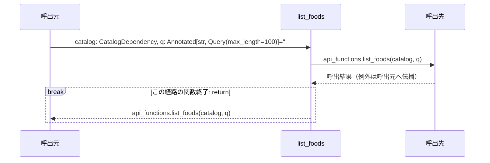
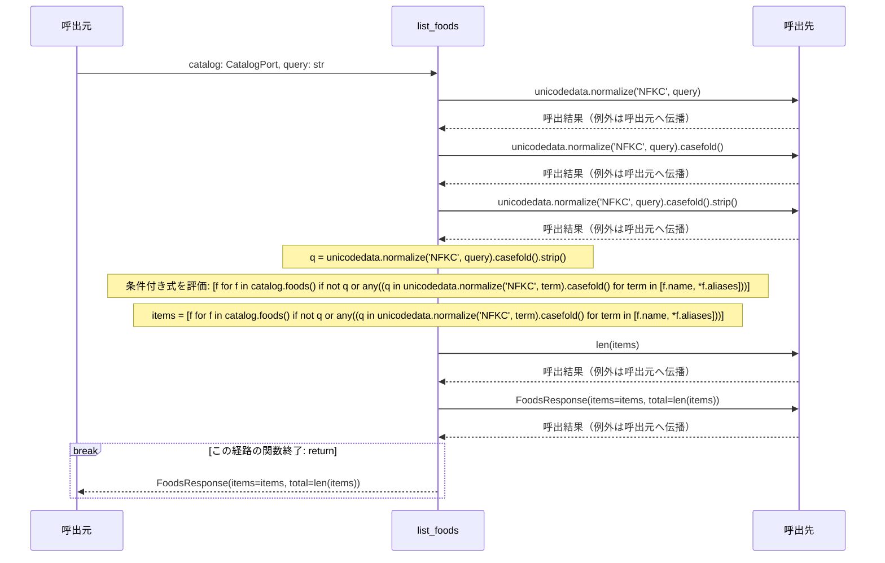

# シーケンス: list_foods

実装から自動生成。手編集禁止。`uv run python tools/generate_service_design.py` で更新。

対象はrouter.py・functions.pyの各関数。呼出元・関数・呼出先の3者で、関数内の分岐と反復を示す。関数間を推測で展開せず、呼出先の名前をそのまま記載する。内包表記・短絡評価は条件付き式のまま残す。FastAPIの依存解決、middleware、連携ポートの実装内部はこの図の対象外で、詳細設計と定義元を参照する。continue/breakは注記位置で該当経路を終了し、次の反復/ループ外へ進む。

### router.py: `list_foods`

定義元: `backend/src/app/apis/foods/list_foods/router.py:15`



#### 対応する実装

```python
@router.get(CONTRACT.path, operation_id=CONTRACT.operation_id, summary=CONTRACT.summary)
def list_foods(catalog: CatalogDependency, q: Annotated[str, Query(max_length=100)]='') -> FoodsResponse:
    return api_functions.list_foods(catalog, q)
```

### functions.py: `list_foods`

定義元: `backend/src/app/apis/foods/list_foods/functions.py:8`



#### 対応する実装

```python
def list_foods(catalog: CatalogPort, query: str) -> FoodsResponse:
    """正規化した検索語に一致するサンプル食材名と別名を返す。"""
    q = unicodedata.normalize('NFKC', query).casefold().strip()
    items = [f for f in catalog.foods() if not q or any((q in unicodedata.normalize('NFKC', term).casefold() for term in [f.name, *f.aliases]))]
    return FoodsResponse(items=items, total=len(items))
```
