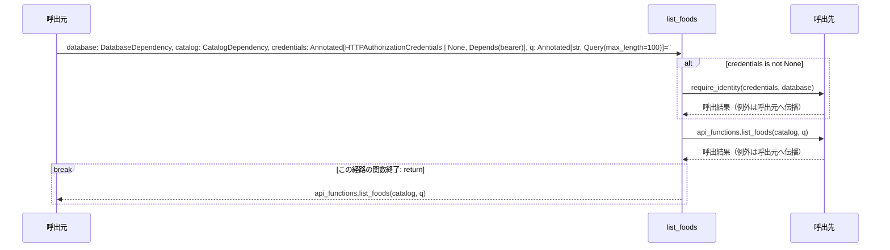
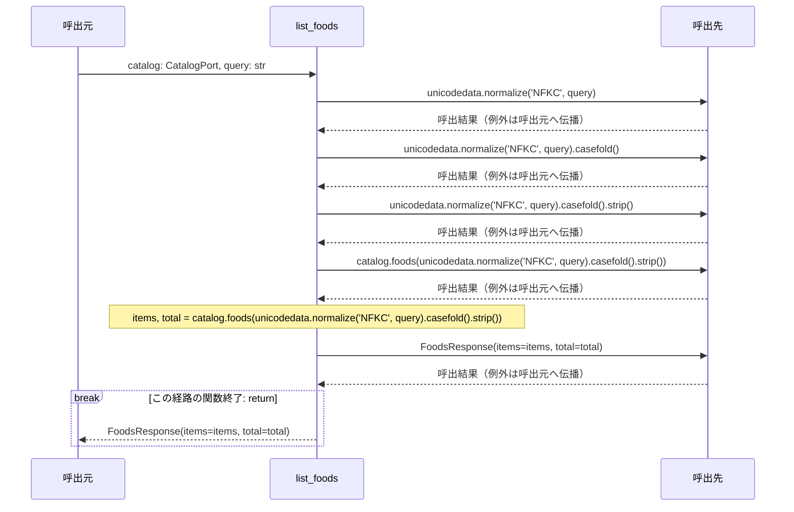
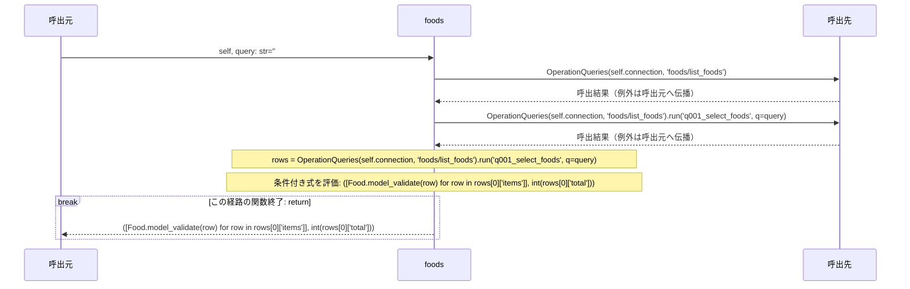

# シーケンス: list_foods

[詳細](detail.md) / [入出力](interface.md) / [ログ](messages.md) / [SQL](queries.md) / [シーケンス](sequence.md) / [要因別試験](tests.md) / [API一覧](../../README.md)

実装から自動生成。手編集禁止。`uv run python tools/generate_service_design.py` で更新。

対象はrouter.py・functions.pyの各関数。呼出元・関数・呼出先の3者で、関数内の分岐と反復を示す。関数間を推測で展開せず、呼出先の名前をそのまま記載する。内包表記・短絡評価は条件付き式のまま残す。ローカル関数は字句スコープ付きの別図にし、関数定義と本文の実行を区別する。エンティティAPIは共有EntityServiceも含める。FastAPIの依存解決、middleware、DBドライバー内部はこの図の対象外。try/except/else/finallyとcontext境界を保持する。continue/breakは注記位置で該当経路を終了し、次の反復/ループ外へ進む。

### router.py: `list_foods`

定義元: `backend/src/app/apis/foods/list_foods/router.py:28`

### functions.py: `list_foods`

定義元: `backend/src/app/apis/foods/list_foods/functions.py:8`

### postgres_provider.py: `foods`

定義元: `backend/src/app/integrations/catalog/postgres_provider.py:18`

