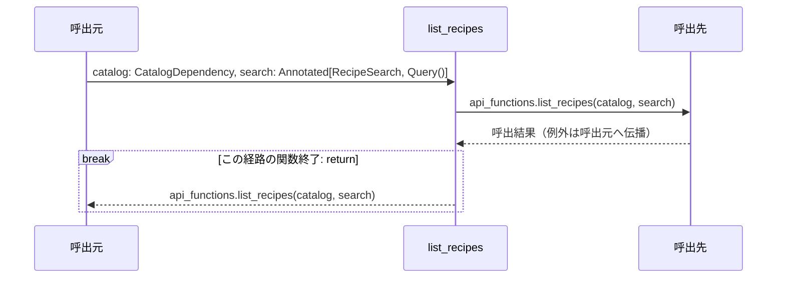
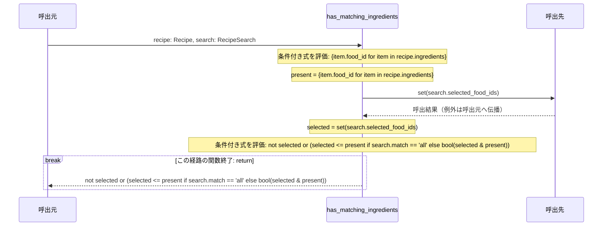
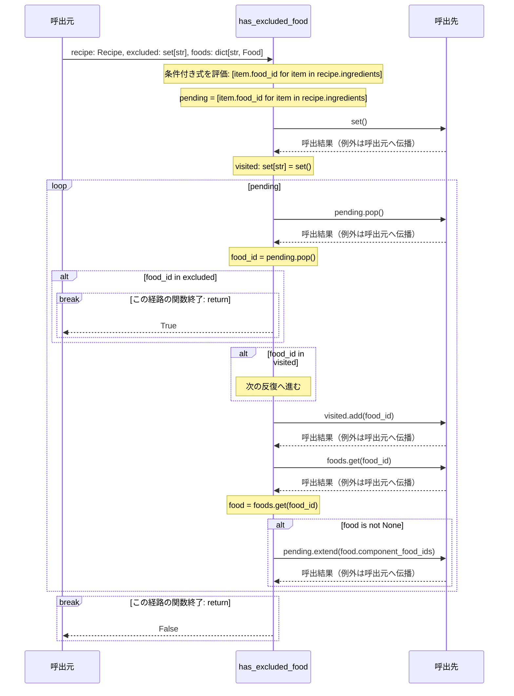
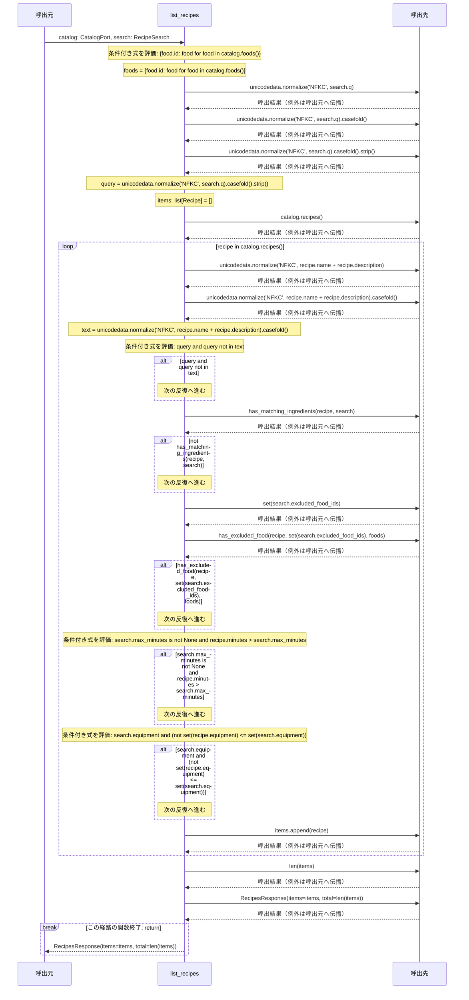

# シーケンス: list_recipes

実装から自動生成。手編集禁止。`uv run python tools/generate_service_design.py` で更新。

対象はrouter.py・functions.pyの各関数。呼出元・関数・呼出先の3者で、関数内の分岐と反復を示す。関数間を推測で展開せず、呼出先の名前をそのまま記載する。内包表記・短絡評価は条件付き式のまま残す。FastAPIの依存解決、middleware、連携ポートの実装内部はこの図の対象外で、詳細設計と定義元を参照する。continue/breakは注記位置で該当経路を終了し、次の反復/ループ外へ進む。

### router.py: `list_recipes`

定義元: `backend/src/app/apis/recipes/list_recipes/router.py:15`



#### 対応する実装

```python
@router.get(CONTRACT.path, operation_id=CONTRACT.operation_id, summary=CONTRACT.summary)
def list_recipes(catalog: CatalogDependency, search: Annotated[RecipeSearch, Query()]) -> RecipesResponse:
    return api_functions.list_recipes(catalog, search)
```

### functions.py: `has_matching_ingredients`

定義元: `backend/src/app/apis/recipes/list_recipes/functions.py:9`



#### 対応する実装

```python
def has_matching_ingredients(recipe: Recipe, search: RecipeSearch) -> bool:
    """選択食材の全件一致・部分一致を適用する。人数は検索条件に含めない。"""
    present = {item.food_id for item in recipe.ingredients}
    selected = set(search.selected_food_ids)
    return not selected or (selected <= present if search.match == 'all' else bool(selected & present))
```

### functions.py: `has_excluded_food`

定義元: `backend/src/app/apis/recipes/list_recipes/functions.py:18`



#### 対応する実装

```python
def has_excluded_food(recipe: Recipe, excluded: set[str], foods: dict[str, Food]) -> bool:
    """判明している構成食材を含む複合食品を除外する。アレルギー対応を保証しない。"""
    pending = [item.food_id for item in recipe.ingredients]
    visited: set[str] = set()
    while pending:
        food_id = pending.pop()
        if food_id in excluded:
            return True
        if food_id in visited:
            continue
        visited.add(food_id)
        food = foods.get(food_id)
        if food is not None:
            pending.extend(food.component_food_ids)
    return False
```

### functions.py: `list_recipes`

定義元: `backend/src/app/apis/recipes/list_recipes/functions.py:35`



#### 対応する実装

```python
def list_recipes(catalog: CatalogPort, search: RecipeSearch) -> RecipesResponse:
    """件数を水増しせず、対象を限定したサンプル料理を検索する。"""
    foods = {food.id: food for food in catalog.foods()}
    query = unicodedata.normalize('NFKC', search.q).casefold().strip()
    items: list[Recipe] = []
    for recipe in catalog.recipes():
        text = unicodedata.normalize('NFKC', recipe.name + recipe.description).casefold()
        if query and query not in text:
            continue
        if not has_matching_ingredients(recipe, search):
            continue
        if has_excluded_food(recipe, set(search.excluded_food_ids), foods):
            continue
        if search.max_minutes is not None and recipe.minutes > search.max_minutes:
            continue
        if search.equipment and (not set(recipe.equipment) <= set(search.equipment)):
            continue
        items.append(recipe)
    return RecipesResponse(items=items, total=len(items))
```
