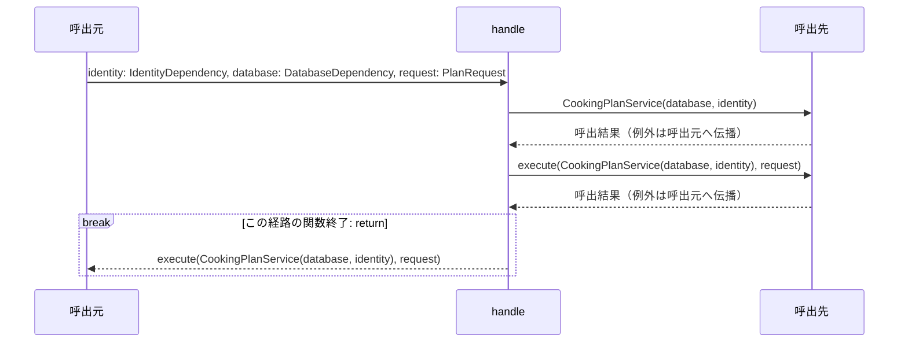
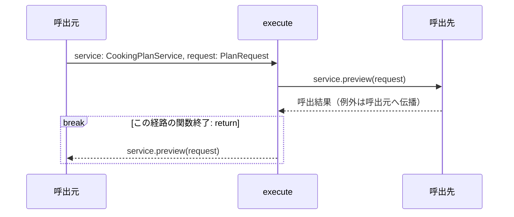
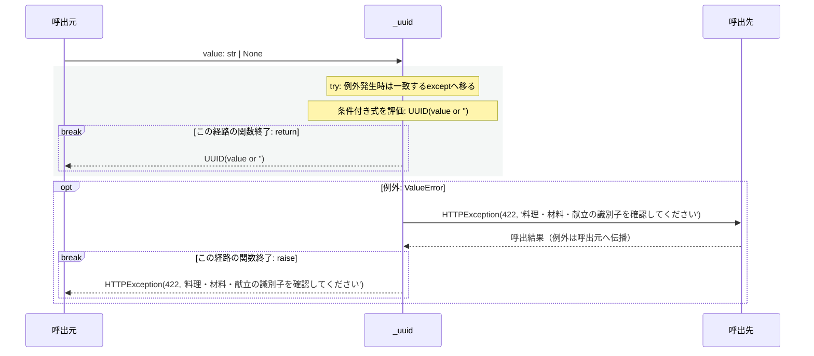
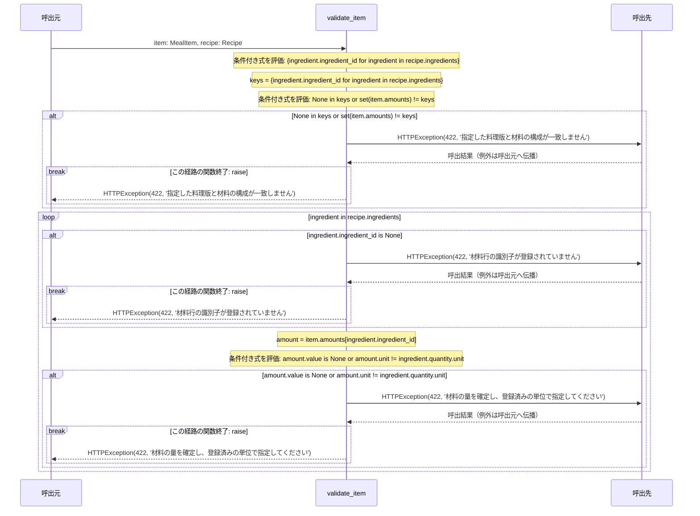
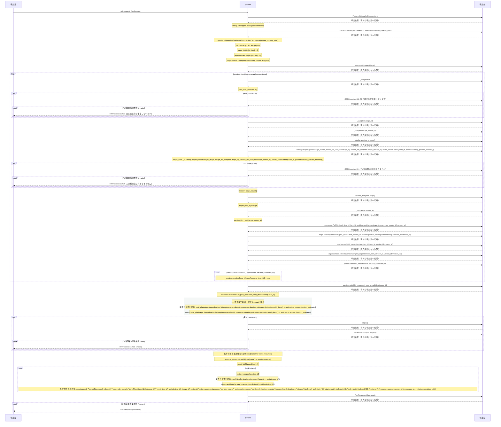

# シーケンス: preview_cooking_plan

[詳細](detail.md) / [入出力](interface.md) / [ログ](messages.md) / [SQL](queries.md) / [シーケンス](sequence.md) / [要因別試験](tests.md) / [API一覧](../../README.md)

実装から自動生成。手編集禁止。`uv run python tools/generate_service_design.py` で更新。

対象はrouter.py・functions.pyの各関数。呼出元・関数・呼出先の3者で、関数内の分岐と反復を示す。関数間を推測で展開せず、呼出先の名前をそのまま記載する。内包表記・短絡評価は条件付き式のまま残す。ローカル関数は字句スコープ付きの別図にし、関数定義と本文の実行を区別する。エンティティAPIは共有EntityServiceも含める。FastAPIの依存解決、middleware、DBドライバー内部はこの図の対象外。try/except/else/finallyとcontext境界を保持する。continue/breakは注記位置で該当経路を終了し、次の反復/ループ外へ進む。

### router.py: `handle`

定義元: `backend/src/app/apis/workspace/preview_cooking_plan/router.py:22`

### functions.py: `execute`

定義元: `backend/src/app/apis/workspace/preview_cooking_plan/functions.py:4`

### cooking_plan_service.py: `_uuid`

定義元: `backend/src/app/core/cooking_plan_service.py:33`

### cooking_plan_service.py: `validate_item`

定義元: `backend/src/app/core/cooking_plan_service.py:40`

### cooking_plan_service.py: `preview`

定義元: `backend/src/app/core/cooking_plan_service.py:60`

### postgres_provider.py: `recipes`

定義元: `backend/src/app/integrations/catalog/postgres_provider.py:24`

```mermaid
sequenceDiagram
    participant Caller as 呼出元
    participant Function as recipes
    participant Callee as 呼出先
    Caller->>Function: self, *, operation: Literal[#39;list_recipes#39;, #39;get_recipe#39;, #39;random_recipe#39;], query: str=#39;#39;, selected_food_ids: list[UUID] | None=None, excluded_food_ids: list[UUID] | None=None, match: Literal[#39;all#39;, #39;any#39;]=#39;all#39;, max_minutes: float | None=None, equipment: list[str] | None=None, limit: int=50, offset: int=0, preview: bool=False, recipe_id: UUID | None=None, exclude_id: UUID | None=None, version_id: UUID | None=None, owner_id: UUID | None=None
    Note over Function: queries = {#39;list_recipes#39;: (#39;recipes/list_recipes#39;, #39;q001_select_recipes#39;), #39;get_recipe#39;: (#39;recipes/get_recipe#39;, #39;q001_select_recipe#39;), #39;random_recipe#39;: (#39;recipes/random_recipe#39;, #39;q001_random_recipe#39;)}
    Note over Function: slug, statement = queries[operation]
    Note over Function: 条件付き式を評価: dict(q=query, selected_food_ids=selected_food_ids or [], excluded_food_ids=excluded_food_ids or [], match=match, max_minutes=max_minutes, equipment=equipment or [], limit=limit, offset=offset, preview=preview, recipe_id=recipe_id, exclude_id=exclude_id)
    Note over Function: parameters: dict[str, Any] = dict(q=query, selected_food_ids=selected_food_ids or [], excluded_food_ids=excluded_food_ids or [], match=match, max_minutes=max_minutes, equipment=equipment or [], limit=limit, offset=offset, preview=preview, recipe_id=recipe_id, exclude_id=exclude_id)
    alt operation == #39;get_recipe#39;
        Function->>Callee: parameters.update(version_id=version_id, owner_id=owner_id)
        Callee-->>Function: 呼出結果（例外は呼出元へ伝播）
    end
    Function->>Callee: OperationQueries(self.connection, slug)
    Callee-->>Function: 呼出結果（例外は呼出元へ伝播）
    Function->>Callee: OperationQueries(self.connection, slug).run(statement, **parameters)
    Callee-->>Function: 呼出結果（例外は呼出元へ伝播）
    Note over Function: rows = OperationQueries(self.connection, slug).run(statement, **parameters)
    Note over Function: 条件付き式を評価: ([Recipe.model_validate(row) for row in rows[0][#39;items#39;]], int(rows[0][#39;total#39;]))
    break この経路の関数終了: return
        Function-->>Caller: ([Recipe.model_validate(row) for row in rows[0][#39;items#39;]], int(rows[0][#39;total#39;]))
    end
```

