# シーケンス: put_settings

[詳細](detail.md) / [入出力](interface.md) / [ログ](messages.md) / [SQL](queries.md) / [シーケンス](sequence.md) / [要因別試験](tests.md) / [API一覧](../../README.md)

実装から自動生成。手編集禁止。`uv run python tools/generate_service_design.py` で更新。

対象はrouter.py・functions.pyの各関数。呼出元・関数・呼出先の3者で、関数内の分岐と反復を示す。関数間を推測で展開せず、呼出先の名前をそのまま記載する。内包表記・短絡評価は条件付き式のまま残す。エンティティAPIは共有EntityServiceも含める。FastAPIの依存解決、middleware、DBドライバー内部はこの図の対象外。try/except/else/finallyとcontext境界を保持する。continue/breakは注記位置で該当経路を終了し、次の反復/ループ外へ進む。

### router.py: `handle`

定義元: `backend/src/app/apis/workspace/put_settings/router.py:22`

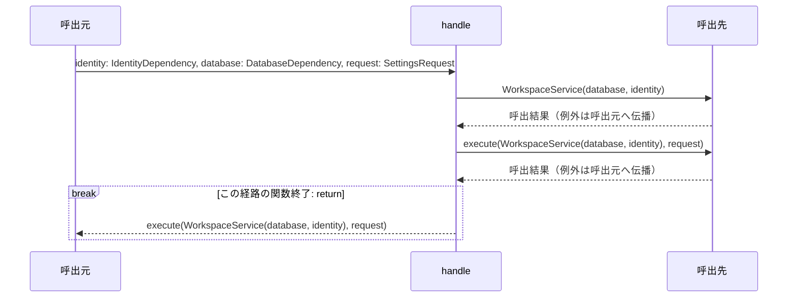

### functions.py: `execute`

定義元: `backend/src/app/apis/workspace/put_settings/functions.py:6`

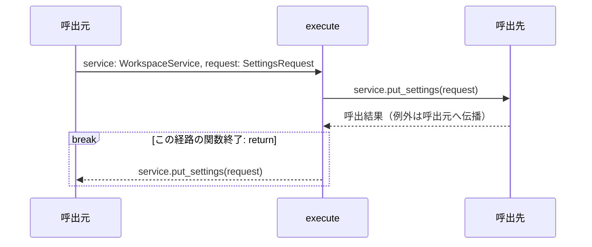

### workspace_service.py: `identifier`

定義元: `backend/src/app/core/workspace_service.py:32`

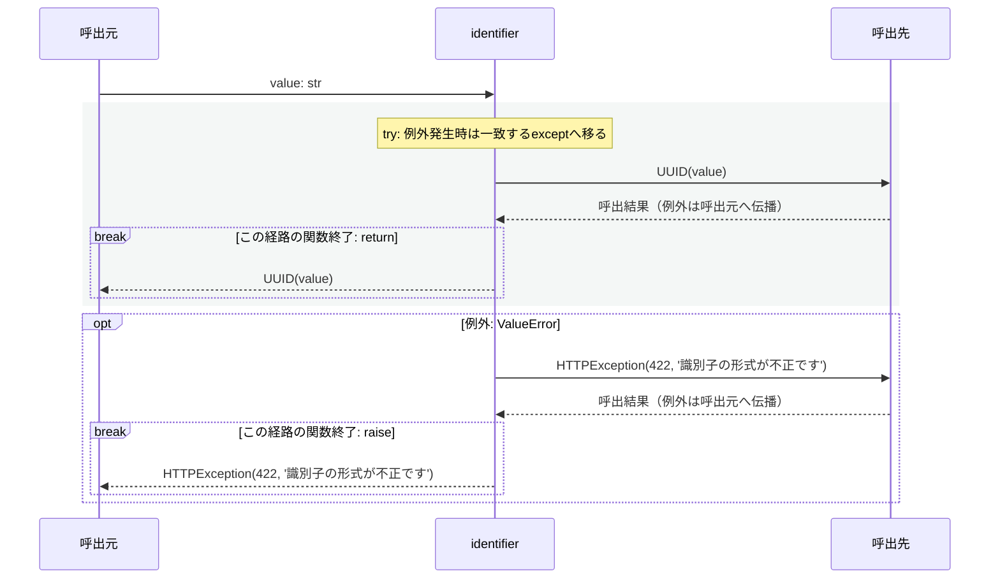

### workspace_service.py: `quantity`

定義元: `backend/src/app/core/workspace_service.py:40`

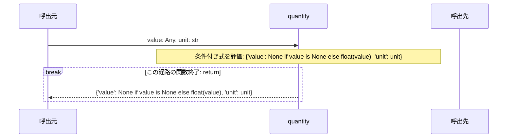

### workspace_service.py: `iso`

定義元: `backend/src/app/core/workspace_service.py:45`

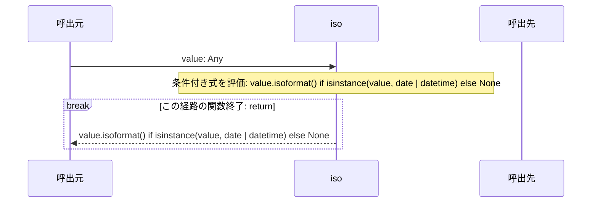

### workspace_service.py: `queries`

定義元: `backend/src/app/core/workspace_service.py:59`

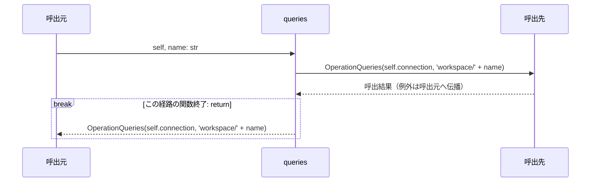

### workspace_service.py: `begin`

定義元: `backend/src/app/core/workspace_service.py:62`

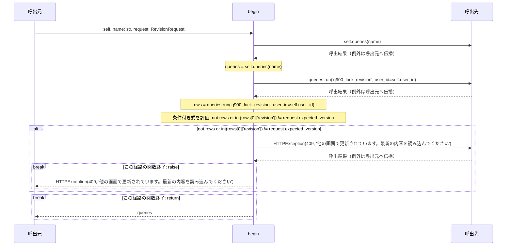

### workspace_service.py: `finish`

定義元: `backend/src/app/core/workspace_service.py:69`

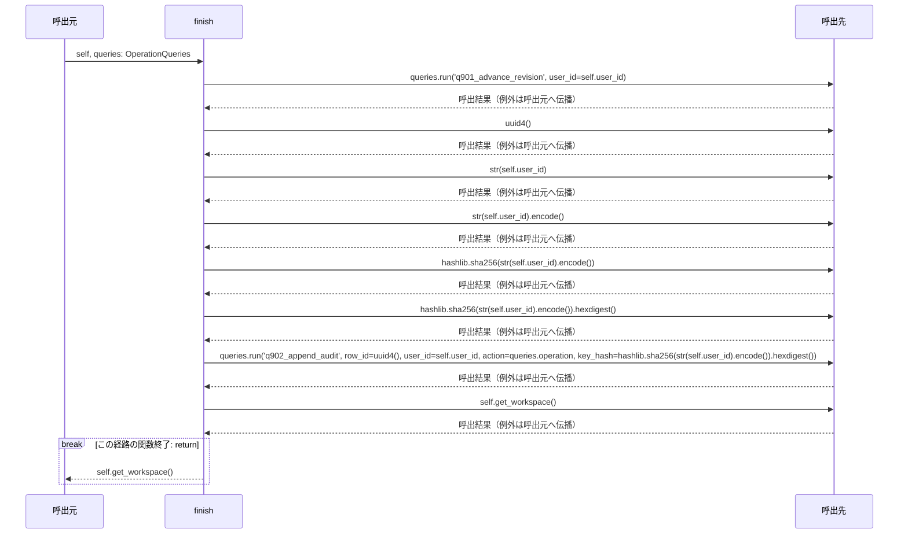

### workspace_service.py: `get_workspace`

定義元: `backend/src/app/core/workspace_service.py:80`

```mermaid
sequenceDiagram
    participant Caller as 呼出元
    participant Function as get_workspace
    participant Callee as 呼出先
    Caller->>Function: self
    Function->>Callee: self.queries(#39;get_workspace#39;)
    Callee-->>Function: 呼出結果（例外は呼出元へ伝播）
    Note over Function: q = self.queries(#39;get_workspace#39;)
    Function->>Callee: q.run(#39;q001_revision#39;, user_id=self.user_id)
    Callee-->>Function: 呼出結果（例外は呼出元へ伝播）
    Note over Function: revision = q.run(#39;q001_revision#39;, user_id=self.user_id)
    Function->>Callee: q.run(#39;q003_consumption#39;, user_id=self.user_id)
    Callee-->>Function: 呼出結果（例外は呼出元へ伝播）
    Note over Function: consumptions = q.run(#39;q003_consumption#39;, user_id=self.user_id)
    Note over Function: 条件付き式を評価: [{#39;id#39;: str(r[#39;id#39;]), #39;foodId#39;: str(r[#39;food_id#39;]), #39;originalFoodId#39;: str(r[#39;original_food_id#39;]), #39;quantity#39;: quantity(r[#39;amount#39;], r[#39;unit#39;]), #39;originalQuantity#39;: quantity(r[#39;original_amount#39;], r[#39;original_unit#39;]), #39;form#39;: r[#39;form#39;], #39;location#39;: DISPLAY_LOCATIONS[r[#39;location#39;]], #39;priority#39;: r[#39;priority#39;] == #39;use_first#39;, #39;expiresOn#39;: iso(r[#39;expires_on#39;]), #39;createdAt#39;: iso(r[#39;created_at#39;]), #39;updatedAt#39;: iso(r[#39;updated_at#39;]), #39;sourceImportId#39;: str(r[#39;source_import_id#39;]) if r[#39;source_import_id#39;] else None, #39;status#39;: r[#39;status#39;], #39;edited#39;: r[#39;edited#39;], #39;consumed#39;: [quantity(c[#39;amount#39;], c[#39;unit#39;]) for c in consumptions if c[#39;lot_id#39;] == r[#39;id#39;]]} for r in q.run(#39;q002_lots#39;, user_id=self.user_id)]
    Note over Function: lots = [{#39;id#39;: str(r[#39;id#39;]), #39;foodId#39;: str(r[#39;food_id#39;]), #39;originalFoodId#39;: str(r[#39;original_food_id#39;]), #39;quantity#39;: quantity(r[#39;amount#39;], r[#39;unit#39;]), #39;originalQuantity#39;: quantity(r[#39;original_amount#39;], r[#39;original_unit#39;]), #39;form#39;: r[#39;form#39;], #39;location#39;: DISPLAY_LOCATIONS[r[#39;location#39;]], #39;priority#39;: r[#39;priority#39;] == #39;use_first#39;, #39;expiresOn#39;: iso(r[#39;expires_on#39;]), #39;createdAt#39;: iso(r[#39;created_at#39;]), #39;updatedAt#39;: iso(r[#39;updated_at#39;]), #39;sourceImportId#39;: str(r[#39;source_import_id#39;]) if r[#39;source_import_id#39;] else None, #39;status#39;: r[#39;status#39;], #39;edited#39;: r[#39;edited#39;], #39;consumed#39;: [quantity(c[#39;amount#39;], c[#39;unit#39;]) for c in consumptions if c[#39;lot_id#39;] == r[#39;id#39;]]} for r in q.run(#39;q002_lots#39;, user_id=self.user_id)]
    Note over Function: 条件付き式を評価: [{#39;id#39;: str(r[#39;id#39;]), #39;imageHash#39;: r[#39;file_sha256#39;], #39;purchaseSignature#39;: r[#39;idempotency_key#39;].split(#39;:#39;)[0], #39;createdAt#39;: iso(r[#39;created_at#39;]), #39;state#39;: #39;registered#39; if r[#39;status#39;] == #39;committed#39; else #39;undone#39;, #39;createdLotIds#39;: [lot[#39;id#39;] for lot in lots if lot[#39;sourceImportId#39;] == str(r[#39;id#39;])], #39;undoneAt#39;: iso(r[#39;reverted_at#39;])} for r in q.run(#39;q004_receipts#39;, user_id=self.user_id)]
    Note over Function: imports = [{#39;id#39;: str(r[#39;id#39;]), #39;imageHash#39;: r[#39;file_sha256#39;], #39;purchaseSignature#39;: r[#39;idempotency_key#39;].split(#39;:#39;)[0], #39;createdAt#39;: iso(r[#39;created_at#39;]), #39;state#39;: #39;registered#39; if r[#39;status#39;] == #39;committed#39; else #39;undone#39;, #39;createdLotIds#39;: [lot[#39;id#39;] for lot in lots if lot[#39;sourceImportId#39;] == str(r[#39;id#39;])], #39;undoneAt#39;: iso(r[#39;reverted_at#39;])} for r in q.run(#39;q004_receipts#39;, user_id=self.user_id)]
    Function->>Callee: self.read_meal(q, self.menu_id)
    Callee-->>Function: 呼出結果（例外は呼出元へ伝播）
    Note over Function: meal = self.read_meal(q, self.menu_id)
    Note over Function: settings: dict[str, list[str]] = {#39;excludedFoodIds#39;: [], #39;pantryFoodIds#39;: [], #39;equipment#39;: []}
    Note over Function: setting_keys = {#39;excluded#39;: #39;excludedFoodIds#39;, #39;pantry#39;: #39;pantryFoodIds#39;, #39;equipment#39;: #39;equipment#39;}
    Function->>Callee: q.run(#39;q008_settings#39;, user_id=self.user_id)
    Callee-->>Function: 呼出結果（例外は呼出元へ伝播）
    loop r in q.run(#39;q008_settings#39;, user_id=self.user_id)
        Function->>Callee: settings[setting_keys[r[#39;kind#39;]]].append(r[#39;setting_value#39;])
        Callee-->>Function: 呼出結果（例外は呼出元へ伝播）
    end
    Note over Function: 条件付き式を評価: [{#39;id#39;: str(r[#39;id#39;]), #39;name#39;: r[#39;name#39;], #39;aliases#39;: [], #39;category#39;: #39;追加した食材#39;, #39;defaultUnit#39;: r[#39;unit#39;], #39;location#39;: #39;冷蔵#39;, #39;pantry#39;: False, #39;imageIndex#39;: None, #39;componentsKnown#39;: False, #39;componentFoodIds#39;: []} for r in q.run(#39;q009_custom_foods#39;, user_id=self.user_id)]
    Note over Function: customs: list[dict[str, Any]] = [{#39;id#39;: str(r[#39;id#39;]), #39;name#39;: r[#39;name#39;], #39;aliases#39;: [], #39;category#39;: #39;追加した食材#39;, #39;defaultUnit#39;: r[#39;unit#39;], #39;location#39;: #39;冷蔵#39;, #39;pantry#39;: False, #39;imageIndex#39;: None, #39;componentsKnown#39;: False, #39;componentFoodIds#39;: []} for r in q.run(#39;q009_custom_foods#39;, user_id=self.user_id)]
    Note over Function: 条件付き式を評価: [{#39;key#39;: r[#39;client_key#39;], #39;signature#39;: r[#39;signature#39;], #39;foodId#39;: str(r[#39;food_id#39;]), #39;quantity#39;: quantity(r[#39;amount#39;], r[#39;unit#39;]), #39;checkedAt#39;: iso(r[#39;checked_at#39;]), #39;archived#39;: r[#39;archived#39;]} for r in q.run(#39;q010_shopping#39;, user_id=self.user_id)]
    Note over Function: checks = [{#39;key#39;: r[#39;client_key#39;], #39;signature#39;: r[#39;signature#39;], #39;foodId#39;: str(r[#39;food_id#39;]), #39;quantity#39;: quantity(r[#39;amount#39;], r[#39;unit#39;]), #39;checkedAt#39;: iso(r[#39;checked_at#39;]), #39;archived#39;: r[#39;archived#39;]} for r in q.run(#39;q010_shopping#39;, user_id=self.user_id)]
    Note over Function: from app.core.cooking_service import CookingService
    Function->>Callee: CookingService(self)
    Callee-->>Function: 呼出結果（例外は呼出元へ伝播）
    Function->>Callee: CookingService(self).read_current()
    Callee-->>Function: 呼出結果（例外は呼出元へ伝播）
    Note over Function: cooking = CookingService(self).read_current()
    Note over Function: 条件付き式を評価: AppSnapshot.model_validate({#39;schemaVersion#39;: 1, #39;version#39;: int(revision[0][#39;revision#39;]) if revision else 0, #39;lots#39;: lots, #39;imports#39;: imports, #39;drafts#39;: {}, #39;meal#39;: meal, #39;saved#39;: [str(r[#39;recipe_id#39;]) for r in q.run(#39;q007_saved#39;, user_id=self.user_id)], #39;shoppingChecks#39;: checks, #39;cooking#39;: cooking, #39;settings#39;: settings, #39;customFoods#39;: customs, #39;search#39;: {#39;selectedFoodIds#39;: [], #39;match#39;: #39;all#39;, #39;maxMinutes#39;: None, #39;noShopping#39;: False, #39;equipment#39;: []}})
    break この経路の関数終了: return
        Function-->>Caller: AppSnapshot.model_validate({#39;schemaVersion#39;: 1, #39;version#39;: int(revision[0][#39;revision#39;]) if revision else 0, #39;lots#39;: lots, #39;imports#39;: imports, #39;drafts#39;: {}, #39;meal#39;: meal, #39;saved#39;: [str(r[#39;recipe_id#39;]) for r in q.run(#39;q007_saved#39;, user_id=self.user_id)], #39;shoppingChecks#39;: checks, #39;cooking#39;: cooking, #39;settings#39;: settings, #39;customFoods#39;: customs, #39;search#39;: {#39;selectedFoodIds#39;: [], #39;match#39;: #39;all#39;, #39;maxMinutes#39;: None, #39;noShopping#39;: False, #39;equipment#39;: []}})
    end
```

### workspace_service.py: `read_meal`

定義元: `backend/src/app/core/workspace_service.py:186`

```mermaid
sequenceDiagram
    participant Caller as 呼出元
    participant Function as read_meal
    participant Callee as 呼出先
    Caller->>Function: self, q: OperationQueries, menu_id: UUID
    Function->>Callee: q.run(#39;q006_ingredients#39;, menu_id=menu_id, user_id=self.user_id)
    Callee-->>Function: 呼出結果（例外は呼出元へ伝播）
    Note over Function: amounts = q.run(#39;q006_ingredients#39;, menu_id=menu_id, user_id=self.user_id)
    Note over Function: 条件付き式を評価: [{#39;id#39;: str(r[#39;id#39;]), #39;recipeId#39;: str(r[#39;recipe_id#39;]), #39;recipeVersionId#39;: str(r[#39;recipe_version_id#39;]), #39;servings#39;: float(r[#39;servings#39;]), #39;adjusted#39;: any((a[#39;override_id#39;] is not None for a in amounts if a[#39;menu_item_id#39;] == r[#39;id#39;])), #39;amounts#39;: {str(a[#39;ingredient_id#39;]): quantity(a[#39;override_amount#39;] if a[#39;override_id#39;] else a[#39;scaled_amount#39;], a[#39;unit#39;]) for a in amounts if a[#39;menu_item_id#39;] == r[#39;id#39;]}} for r in q.run(#39;q005_menu#39;, menu_id=menu_id, user_id=self.user_id)]
    break この経路の関数終了: return
        Function-->>Caller: [{#39;id#39;: str(r[#39;id#39;]), #39;recipeId#39;: str(r[#39;recipe_id#39;]), #39;recipeVersionId#39;: str(r[#39;recipe_version_id#39;]), #39;servings#39;: float(r[#39;servings#39;]), #39;adjusted#39;: any((a[#39;override_id#39;] is not None for a in amounts if a[#39;menu_item_id#39;] == r[#39;id#39;])), #39;amounts#39;: {str(a[#39;ingredient_id#39;]): quantity(a[#39;override_amount#39;] if a[#39;override_id#39;] else a[#39;scaled_amount#39;], a[#39;unit#39;]) for a in amounts if a[#39;menu_item_id#39;] == r[#39;id#39;]}} for r in q.run(#39;q005_menu#39;, menu_id=menu_id, user_id=self.user_id)]
    end
```

### workspace_service.py: `put_settings`

定義元: `backend/src/app/core/workspace_service.py:345`

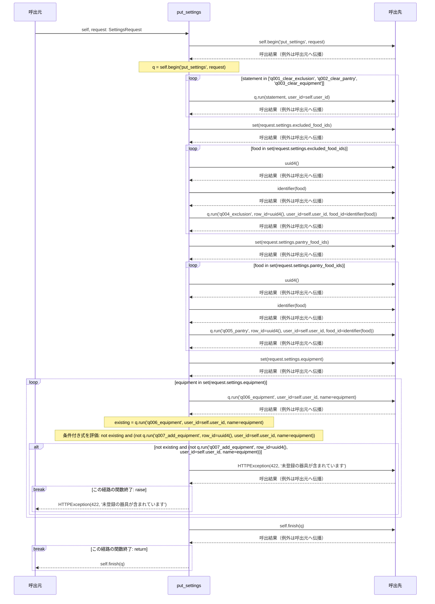
