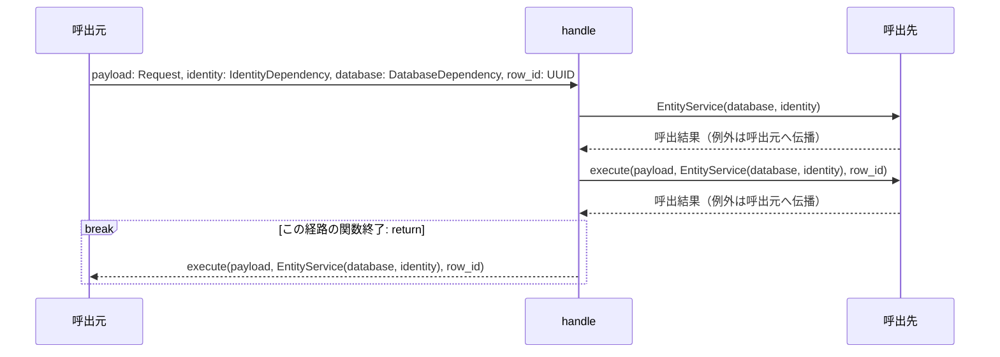
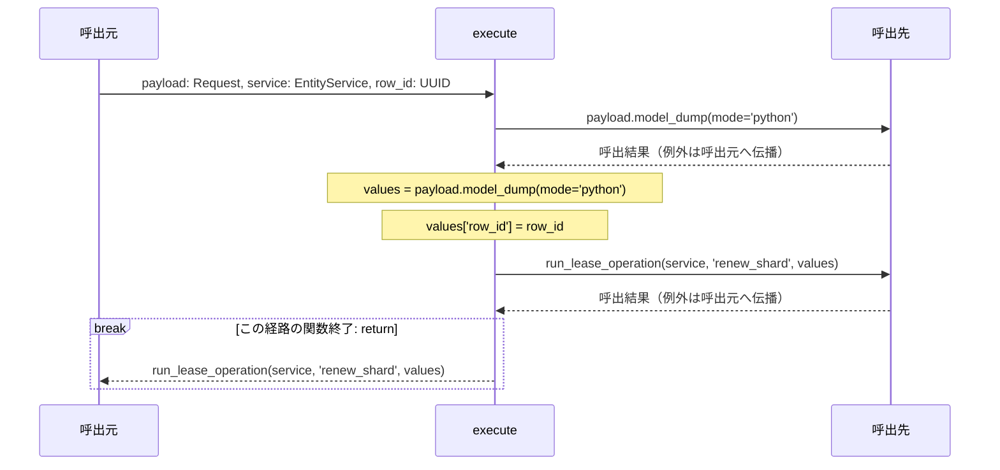
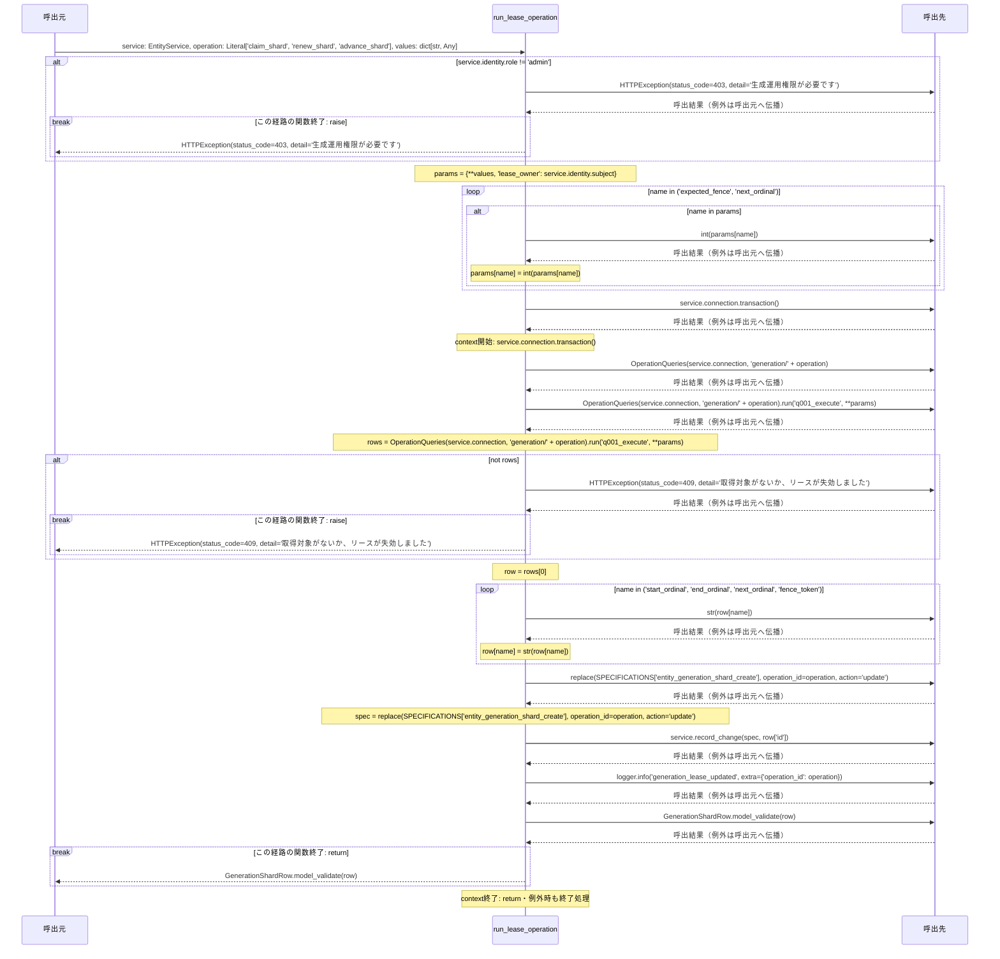
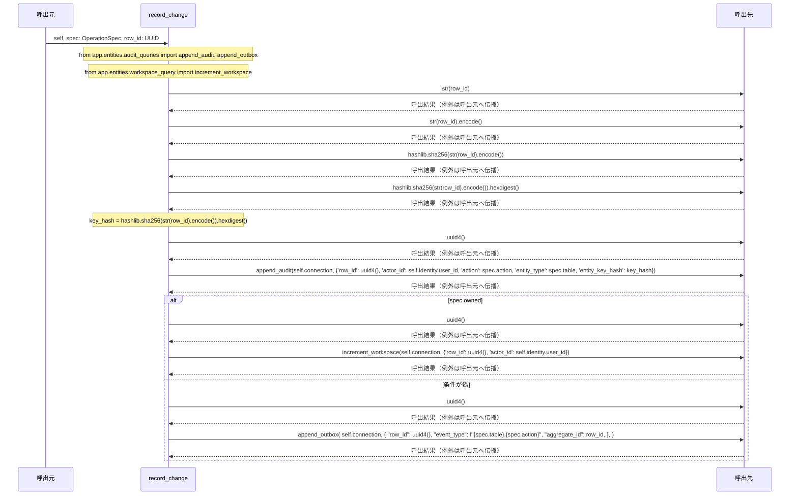

# シーケンス: renew_shard

[詳細](detail.md) / [入出力](interface.md) / [ログ](messages.md) / [SQL](queries.md) / [シーケンス](sequence.md) / [要因別試験](tests.md) / [API一覧](../../README.md)

実装から自動生成。手編集禁止。`uv run python tools/generate_service_design.py` で更新。

対象はrouter.py・functions.pyの各関数。呼出元・関数・呼出先の3者で、関数内の分岐と反復を示す。関数間を推測で展開せず、呼出先の名前をそのまま記載する。内包表記・短絡評価は条件付き式のまま残す。ローカル関数は字句スコープ付きの別図にし、関数定義と本文の実行を区別する。エンティティAPIは共有EntityServiceも含める。FastAPIの依存解決、middleware、DBドライバー内部はこの図の対象外。try/except/else/finallyとcontext境界を保持する。continue/breakは注記位置で該当経路を終了し、次の反復/ループ外へ進む。

### router.py: `handle`

定義元: `backend/src/app/apis/generation/renew_shard/router.py:31`

### functions.py: `execute`

定義元: `backend/src/app/apis/generation/renew_shard/functions.py:11`

### entity_generation.py: `run_lease_operation`

定義元: `backend/src/app/core/entity_generation.py:17`

### entity_service.py: `record_change`

定義元: `backend/src/app/core/entity_service.py:131`

