# シーケンス: restore_backup

[詳細](detail.md) / [入出力](interface.md) / [ログ](messages.md) / [SQL](queries.md) / [シーケンス](sequence.md) / [要因別試験](tests.md) / [API一覧](../../README.md)

実装から自動生成。手編集禁止。`uv run python tools/generate_service_design.py` で更新。

対象はrouter.py・functions.pyの各関数。呼出元・関数・呼出先の3者で、関数内の分岐と反復を示す。関数間を推測で展開せず、呼出先の名前をそのまま記載する。内包表記・短絡評価は条件付き式のまま残す。ローカル関数は字句スコープ付きの別図にし、関数定義と本文の実行を区別する。エンティティAPIは共有EntityServiceも含める。FastAPIの依存解決、middleware、DBドライバー内部はこの図の対象外。try/except/else/finallyとcontext境界を保持する。continue/breakは注記位置で該当経路を終了し、次の反復/ループ外へ進む。

### router.py: `handle`

定義元: `backend/src/app/apis/backup/restore_backup/router.py:22`

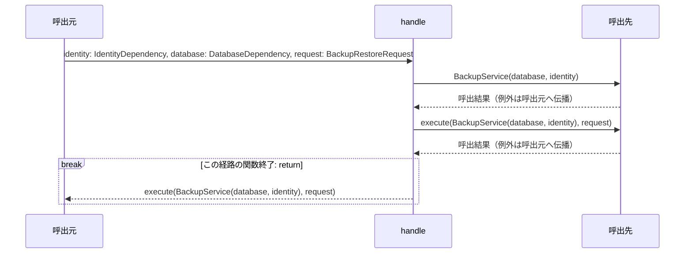

### functions.py: `execute`

定義元: `backend/src/app/apis/backup/restore_backup/functions.py:6`

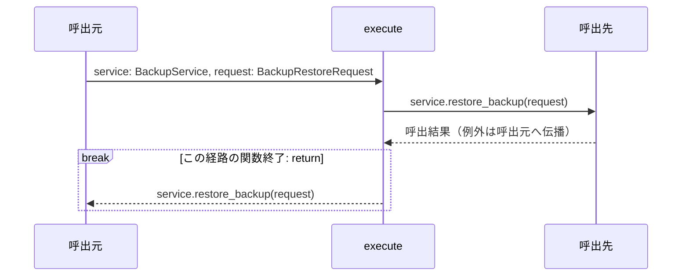

### backup_service.py: `canonical_backup`

定義元: `backend/src/app/core/backup_service.py:37`

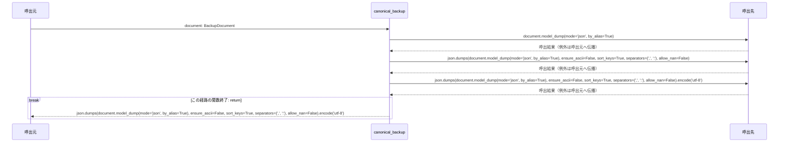

### backup_service.py: `queries`

定義元: `backend/src/app/core/backup_service.py:55`

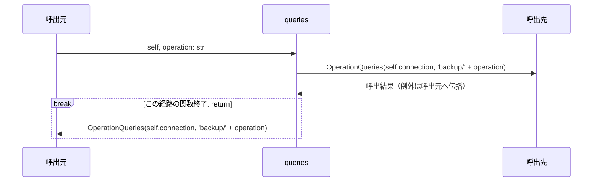

### backup_service.py: `current_revision`

定義元: `backend/src/app/core/backup_service.py:58`

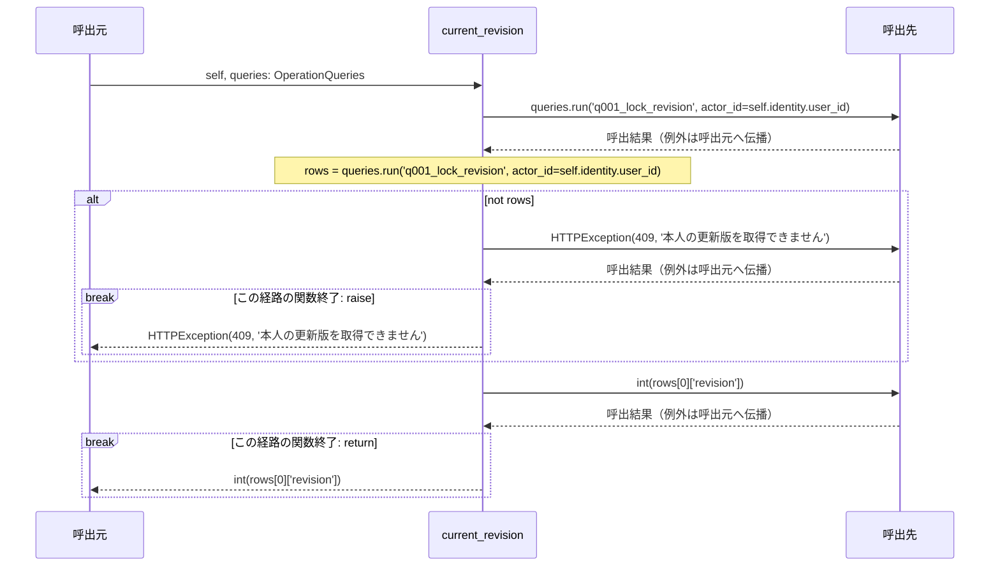

### backup_service.py: `checked_digest`

定義元: `backend/src/app/core/backup_service.py:70`

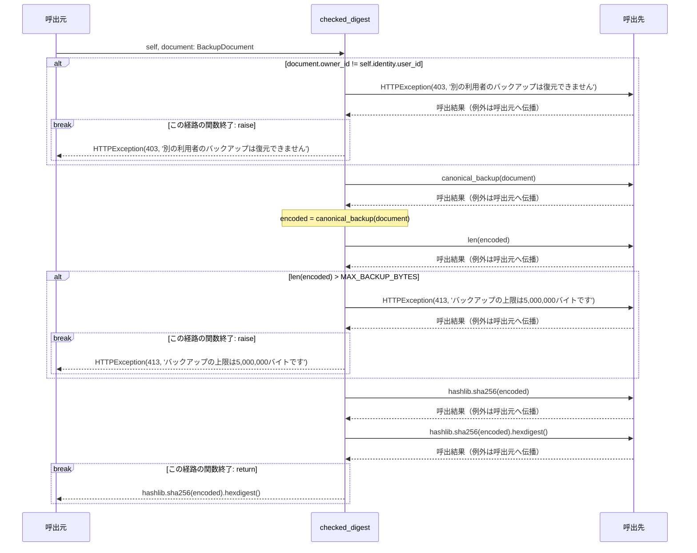

### backup_service.py: `check_proof`

定義元: `backend/src/app/core/backup_service.py:78`

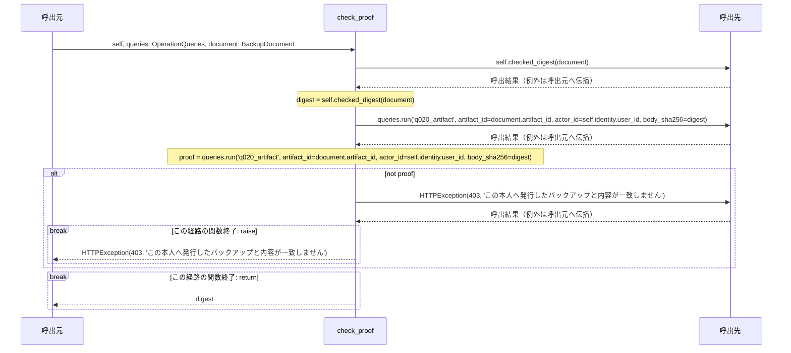

### backup_service.py: `check_references`

定義元: `backend/src/app/core/backup_service.py:116`

```mermaid
sequenceDiagram
    participant Caller as 呼出元
    participant Function as check_references
    participant Callee as 呼出先
    Caller->>Function: self, queries: OperationQueries, document: BackupDocument
    Function->>Callee: document.tables.model_dump(mode=#39;python#39;)
    Callee-->>Function: 呼出結果（例外は呼出元へ伝播）
    Function->>Callee: cast(Rows, document.tables.model_dump(mode=#39;python#39;))
    Callee-->>Function: 呼出結果（例外は呼出元へ伝播）
    Note over Function: data = cast(Rows, document.tables.model_dump(mode=#39;python#39;))
    Note over Function: ids: dict[str, set[UUID]] = {}
    Function->>Callee: defaultdict(set)
    Callee-->>Function: 呼出結果（例外は呼出元へ伝播）
    Note over Function: external: dict[str, set[UUID]] = defaultdict(set)
    Function->>Callee: data.items()
    Callee-->>Function: 呼出結果（例外は呼出元へ伝播）
    loop (table, rows) in data.items()
        Note over Function: 条件付き式を評価: {row[#39;id#39;] for row in rows}
        Note over Function: ids[table] = {row[#39;id#39;] for row in rows}
        Function->>Callee: len(ids[table])
        Callee-->>Function: 呼出結果（例外は呼出元へ伝播）
        Function->>Callee: len(rows)
        Callee-->>Function: 呼出結果（例外は呼出元へ伝播）
        alt len(ids[table]) != len(rows)
            Function->>Callee: HTTPException(422, #39;同じテーブルに重複した行IDがあります#39;)
            Callee-->>Function: 呼出結果（例外は呼出元へ伝播）
            break この経路の関数終了: raise
                Function-->>Caller: HTTPException(422, #39;同じテーブルに重複した行IDがあります#39;)
            end
        end
        loop row in rows
            loop column in (#39;user_id#39;, #39;owner_id#39;)
                Note over Function: 条件付き式を評価: column in row and row[column] != self.identity.user_id
                alt column in row and row[column] != self.identity.user_id
                    Function->>Callee: HTTPException(403, #39;本人の業務行・私有食材だけを復元できます#39;)
                    Callee-->>Function: 呼出結果（例外は呼出元へ伝播）
                    break この経路の関数終了: raise
                        Function-->>Caller: HTTPException(403, #39;本人の業務行・私有食材だけを復元できます#39;)
                    end
                end
            end
        end
    end
    Note over Function: ローカル関数 require_reference を定義。本文は別図に示し、定義しただけでは実行しない。
    Function->>Callee: data.items()
    Callee-->>Function: 呼出結果（例外は呼出元へ伝播）
    loop (table, rows) in data.items()
        loop reference in TABLES[table][#39;references#39;]
            loop row in rows
                Function->>Callee: require_reference(reference[#39;table#39;], row[reference[#39;column#39;]])
                Callee-->>Function: 呼出結果（例外は呼出元へ伝播）
            end
        end
    end
    loop session in data[#39;cooking_session#39;]
        Function->>Callee: CookingInput.model_validate(session[#39;input_snapshot#39;])
        Callee-->>Function: 呼出結果（例外は呼出元へ伝播）
        Note over Function: snapshot = CookingInput.model_validate(session[#39;input_snapshot#39;])
        Function->>Callee: snapshot.model_dump_json()
        Callee-->>Function: 呼出結果（例外は呼出元へ伝播）
        Function->>Callee: snapshot.model_dump_json().encode()
        Callee-->>Function: 呼出結果（例外は呼出元へ伝播）
        Function->>Callee: hashlib.sha256(snapshot.model_dump_json().encode())
        Callee-->>Function: 呼出結果（例外は呼出元へ伝播）
        Function->>Callee: hashlib.sha256(snapshot.model_dump_json().encode()).hexdigest()
        Callee-->>Function: 呼出結果（例外は呼出元へ伝播）
        Note over Function: actual_hash = hashlib.sha256(snapshot.model_dump_json().encode()).hexdigest()
        alt actual_hash != session[#39;input_hash#39;]
            Function->>Callee: HTTPException(409, #39;保存された調理入力とハッシュが一致しません#39;)
            Callee-->>Function: 呼出結果（例外は呼出元へ伝播）
            break この経路の関数終了: raise
                Function-->>Caller: HTTPException(409, #39;保存された調理入力とハッシュが一致しません#39;)
            end
        end
        alt snapshot.menu_revision != session[#39;menu_revision#39;]
            Function->>Callee: HTTPException(409, #39;調理入力の献立版が保存した版と一致しません#39;)
            Callee-->>Function: 呼出結果（例外は呼出元へ伝播）
            break この経路の関数終了: raise
                Function-->>Caller: HTTPException(409, #39;調理入力の献立版が保存した版と一致しません#39;)
            end
        end
        loop item in snapshot.items
            Function->>Callee: require_reference(#39;menu_item#39;, item.id)
            Callee-->>Function: 呼出結果（例外は呼出元へ伝播）
            Function->>Callee: require_reference(#39;recipe_version#39;, item.recipe_version_id)
            Callee-->>Function: 呼出結果（例外は呼出元へ伝播）
        end
        loop ingredient in snapshot.ingredients
            Function->>Callee: require_reference(#39;recipe_ingredient#39;, ingredient.id)
            Callee-->>Function: 呼出結果（例外は呼出元へ伝播）
            Function->>Callee: require_reference(#39;food_form#39;, ingredient.form_id)
            Callee-->>Function: 呼出結果（例外は呼出元へ伝播）
            Function->>Callee: require_reference(#39;unit#39;, ingredient.unit_id)
            Callee-->>Function: 呼出結果（例外は呼出元へ伝播）
            Function->>Callee: require_reference(#39;conversion#39;, ingredient.conversion_id)
            Callee-->>Function: 呼出結果（例外は呼出元へ伝播）
        end
        loop resource in snapshot.resources
            Function->>Callee: require_reference(#39;kitchen_resource#39;, resource.id)
            Callee-->>Function: 呼出結果（例外は呼出元へ伝播）
            Function->>Callee: require_reference(#39;resource_type#39;, resource.resource_type_id)
            Callee-->>Function: 呼出結果（例外は呼出元へ伝播）
        end
    end
    Function->>Callee: external.items()
    Callee-->>Function: 呼出結果（例外は呼出元へ伝播）
    loop (target, values) in external.items()
        Function->>Callee: sorted(values)
        Callee-->>Function: 呼出結果（例外は呼出元へ伝播）
        Function->>Callee: queries.run(#39;q300_reference_#39; + target, reference_ids=sorted(values))
        Callee-->>Function: 呼出結果（例外は呼出元へ伝播）
        Note over Function: actual = queries.run(#39;q300_reference_#39; + target, reference_ids=sorted(values))
        Note over Function: 条件付き式を評価: {row[#39;id#39;] for row in actual} != values
        alt {row[#39;id#39;] for row in actual} != values
            Function->>Callee: HTTPException(409, #39;必要な共有カタログがないか、参照先を利用できません#39;)
            Callee-->>Function: 呼出結果（例外は呼出元へ伝播）
            break この経路の関数終了: raise
                Function-->>Caller: HTTPException(409, #39;必要な共有カタログがないか、参照先を利用できません#39;)
            end
        end
    end
    break この経路の関数終了: return
        Function-->>Caller: data
    end
```

### backup_service.py: `check_references.require_reference`

定義元: `backend/src/app/core/backup_service.py:130`

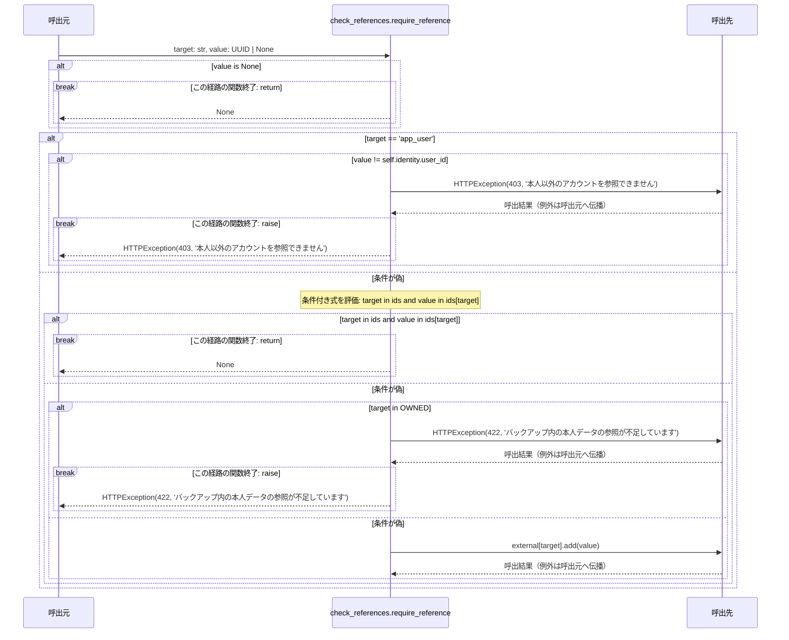

### backup_service.py: `replace_rows`

定義元: `backend/src/app/core/backup_service.py:171`

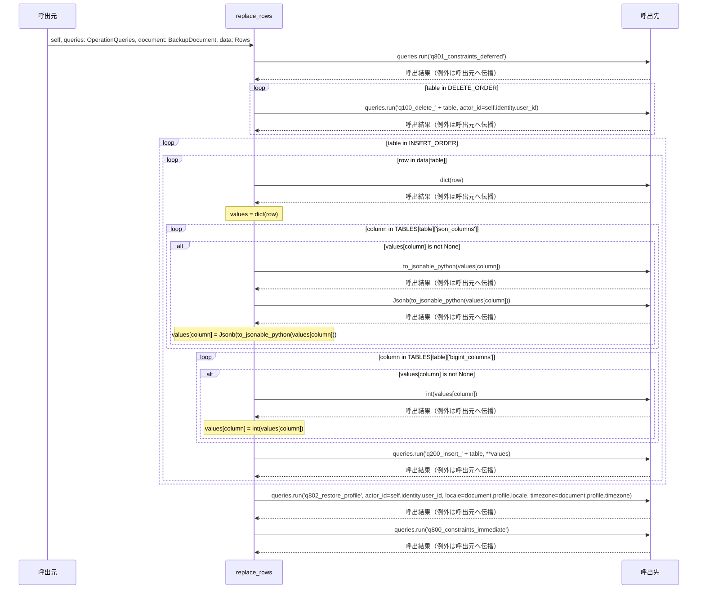

### backup_service.py: `restore_backup`

定義元: `backend/src/app/core/backup_service.py:249`

```mermaid
sequenceDiagram
    participant Caller as 呼出元
    participant Function as restore_backup
    participant Callee as 呼出先
    Caller->>Function: self, request: BackupRestoreRequest
    Function->>Callee: self.queries(#39;restore_backup#39;)
    Callee-->>Function: 呼出結果（例外は呼出元へ伝播）
    Note over Function: queries = self.queries(#39;restore_backup#39;)
    rect rgb(244, 247, 246)
    Note over Function: try: 例外発生時は一致するexceptへ移る
        Function->>Callee: self.connection.transaction()
        Callee-->>Function: 呼出結果（例外は呼出元へ伝播）
        Note over Function: context開始: self.connection.transaction()
        Function->>Callee: self.check_proof(queries, request.backup)
        Callee-->>Function: 呼出結果（例外は呼出元へ伝播）
        Note over Function: digest = self.check_proof(queries, request.backup)
        Function->>Callee: self.current_revision(queries)
        Callee-->>Function: 呼出結果（例外は呼出元へ伝播）
        Note over Function: revision = self.current_revision(queries)
        alt request.expected_version != revision
            Function->>Callee: HTTPException(409, #39;確認後に更新されています。内容をもう一度確認してください#39;)
            Callee-->>Function: 呼出結果（例外は呼出元へ伝播）
            break この経路の関数終了: raise
                Function-->>Caller: HTTPException(409, #39;確認後に更新されています。内容をもう一度確認してください#39;)
            end
        end
        Function->>Callee: queries.run(#39;q023_lock_intent#39;, intent_id=request.intent_id, actor_id=self.identity.user_id, artifact_id=request.backup.artifact_id, body_sha256=digest, current_revision=revision)
        Callee-->>Function: 呼出結果（例外は呼出元へ伝播）
        Note over Function: intent = queries.run(#39;q023_lock_intent#39;, intent_id=request.intent_id, actor_id=self.identity.user_id, artifact_id=request.backup.artifact_id, body_sha256=digest, current_revision=revision)
        alt not intent
            Function->>Callee: HTTPException(409, #39;確認が期限切れ・使用済みです。もう一度内容を確認してください#39;)
            Callee-->>Function: 呼出結果（例外は呼出元へ伝播）
            break この経路の関数終了: raise
                Function-->>Caller: HTTPException(409, #39;確認が期限切れ・使用済みです。もう一度内容を確認してください#39;)
            end
        end
        Function->>Callee: self.check_references(queries, request.backup)
        Callee-->>Function: 呼出結果（例外は呼出元へ伝播）
        Note over Function: data = self.check_references(queries, request.backup)
        Function->>Callee: self.replace_rows(queries, request.backup, data)
        Callee-->>Function: 呼出結果（例外は呼出元へ伝播）
        Function->>Callee: queries.run(#39;q024_consume_intent#39;, intent_id=request.intent_id, actor_id=self.identity.user_id, body_sha256=digest, current_revision=revision)
        Callee-->>Function: 呼出結果（例外は呼出元へ伝播）
        Note over Function: consumed = queries.run(#39;q024_consume_intent#39;, intent_id=request.intent_id, actor_id=self.identity.user_id, body_sha256=digest, current_revision=revision)
        alt not consumed
            Function->>Callee: HTTPException(409, #39;確認が有効でなくなったため復元を取り消しました#39;)
            Callee-->>Function: 呼出結果（例外は呼出元へ伝播）
            break この経路の関数終了: raise
                Function-->>Caller: HTTPException(409, #39;確認が有効でなくなったため復元を取り消しました#39;)
            end
        end
        Function->>Callee: queries.run(#39;q901_advance_revision#39;, actor_id=self.identity.user_id)
        Callee-->>Function: 呼出結果（例外は呼出元へ伝播）
        Function->>Callee: uuid4()
        Callee-->>Function: 呼出結果（例外は呼出元へ伝播）
        Function->>Callee: str(self.identity.user_id)
        Callee-->>Function: 呼出結果（例外は呼出元へ伝播）
        Function->>Callee: str(self.identity.user_id).encode()
        Callee-->>Function: 呼出結果（例外は呼出元へ伝播）
        Function->>Callee: hashlib.sha256(str(self.identity.user_id).encode())
        Callee-->>Function: 呼出結果（例外は呼出元へ伝播）
        Function->>Callee: hashlib.sha256(str(self.identity.user_id).encode()).hexdigest()
        Callee-->>Function: 呼出結果（例外は呼出元へ伝播）
        Function->>Callee: queries.run(#39;q902_append_audit#39;, row_id=uuid4(), actor_id=self.identity.user_id, key_hash=hashlib.sha256(str(self.identity.user_id).encode()).hexdigest())
        Callee-->>Function: 呼出結果（例外は呼出元へ伝播）
        Function->>Callee: uuid4()
        Callee-->>Function: 呼出結果（例外は呼出元へ伝播）
        Note over Function: event_id = uuid4()
        Function->>Callee: queries.run(#39;q903_append_outbox#39;, event_id=event_id, actor_id=self.identity.user_id, version=revision + 1)
        Callee-->>Function: 呼出結果（例外は呼出元へ伝播）
        Function->>Callee: WorkspaceService(self.connection, self.identity)
        Callee-->>Function: 呼出結果（例外は呼出元へ伝播）
        Function->>Callee: WorkspaceService(self.connection, self.identity).get_workspace()
        Callee-->>Function: 呼出結果（例外は呼出元へ伝播）
        Note over Function: result = WorkspaceService(self.connection, self.identity).get_workspace()
        Function->>Callee: len(TABLES)
        Callee-->>Function: 呼出結果（例外は呼出元へ伝播）
        Function->>Callee: logger.info(#39;backup_restore_completed#39;, extra={#39;table_count#39;: len(TABLES)})
        Callee-->>Function: 呼出結果（例外は呼出元へ伝播）
        break この経路の関数終了: return
            Function-->>Caller: result
        end
        Note over Function: context終了: return・例外時も終了処理
    end
    opt 例外: errors.IntegrityError
        Function->>Callee: HTTPException(409, #39;参照・数量・業務制約が成立せず、現在データは変更していません#39;)
        Callee-->>Function: 呼出結果（例外は呼出元へ伝播）
        break この経路の関数終了: raise
            Function-->>Caller: HTTPException(409, #39;参照・数量・業務制約が成立せず、現在データは変更していません#39;)
        end
    end
    opt 例外: errors.InsufficientPrivilege
        Function->>Callee: HTTPException(403, #39;このバックアップの対象を変更する権限がありません#39;)
        Callee-->>Function: 呼出結果（例外は呼出元へ伝播）
        break この経路の関数終了: raise
            Function-->>Caller: HTTPException(403, #39;このバックアップの対象を変更する権限がありません#39;)
        end
    end
    opt 例外: errors.SerializationFailure
        Function->>Callee: HTTPException(409, #39;同時更新がありました。内容をもう一度確認してください#39;)
        Callee-->>Function: 呼出結果（例外は呼出元へ伝播）
        break この経路の関数終了: raise
            Function-->>Caller: HTTPException(409, #39;同時更新がありました。内容をもう一度確認してください#39;)
        end
    end
```

### workspace_service.py: `quantity`

定義元: `backend/src/app/core/workspace_service.py:41`

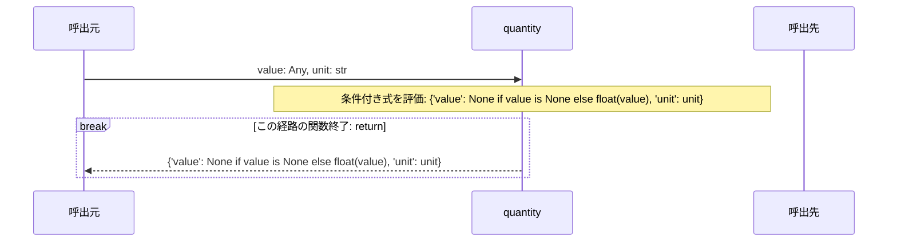

### workspace_service.py: `iso`

定義元: `backend/src/app/core/workspace_service.py:46`

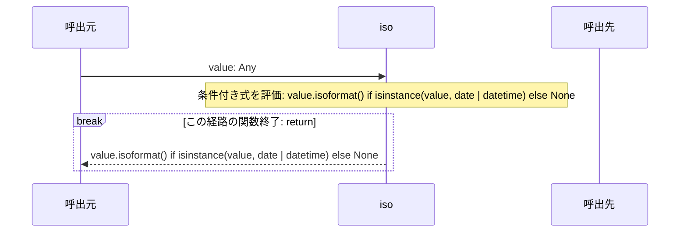

### workspace_service.py: `queries`

定義元: `backend/src/app/core/workspace_service.py:60`

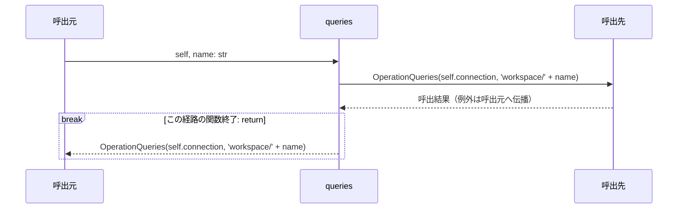

### workspace_service.py: `get_workspace`

定義元: `backend/src/app/core/workspace_service.py:81`

```mermaid
sequenceDiagram
    participant Caller as 呼出元
    participant Function as get_workspace
    participant Callee as 呼出先
    Caller->>Function: self
    Function->>Callee: self.queries(#39;get_workspace#39;)
    Callee-->>Function: 呼出結果（例外は呼出元へ伝播）
    Note over Function: q = self.queries(#39;get_workspace#39;)
    Function->>Callee: q.run(#39;q001_revision#39;, user_id=self.user_id)
    Callee-->>Function: 呼出結果（例外は呼出元へ伝播）
    Note over Function: revision = q.run(#39;q001_revision#39;, user_id=self.user_id)
    Function->>Callee: q.run(#39;q003_consumption#39;, user_id=self.user_id)
    Callee-->>Function: 呼出結果（例外は呼出元へ伝播）
    Note over Function: consumptions = q.run(#39;q003_consumption#39;, user_id=self.user_id)
    Note over Function: 条件付き式を評価: [{#39;id#39;: str(r[#39;id#39;]), #39;foodId#39;: str(r[#39;food_id#39;]), #39;originalFoodId#39;: str(r[#39;original_food_id#39;]), #39;quantity#39;: quantity(r[#39;amount#39;], r[#39;unit#39;]), #39;originalQuantity#39;: quantity(r[#39;original_amount#39;], r[#39;original_unit#39;]), #39;form#39;: r[#39;form#39;], #39;location#39;: DISPLAY_LOCATIONS[r[#39;location#39;]], #39;priority#39;: r[#39;priority#39;] == #39;use_first#39;, #39;expiresOn#39;: iso(r[#39;expires_on#39;]), #39;createdAt#39;: iso(r[#39;created_at#39;]), #39;updatedAt#39;: iso(r[#39;updated_at#39;]), #39;sourceImportId#39;: str(r[#39;source_import_id#39;]) if r[#39;source_import_id#39;] else None, #39;status#39;: r[#39;status#39;], #39;edited#39;: r[#39;edited#39;], #39;consumed#39;: [quantity(c[#39;amount#39;], c[#39;unit#39;]) for c in consumptions if c[#39;lot_id#39;] == r[#39;id#39;]]} for r in q.run(#39;q002_lots#39;, user_id=self.user_id)]
    Note over Function: lots = [{#39;id#39;: str(r[#39;id#39;]), #39;foodId#39;: str(r[#39;food_id#39;]), #39;originalFoodId#39;: str(r[#39;original_food_id#39;]), #39;quantity#39;: quantity(r[#39;amount#39;], r[#39;unit#39;]), #39;originalQuantity#39;: quantity(r[#39;original_amount#39;], r[#39;original_unit#39;]), #39;form#39;: r[#39;form#39;], #39;location#39;: DISPLAY_LOCATIONS[r[#39;location#39;]], #39;priority#39;: r[#39;priority#39;] == #39;use_first#39;, #39;expiresOn#39;: iso(r[#39;expires_on#39;]), #39;createdAt#39;: iso(r[#39;created_at#39;]), #39;updatedAt#39;: iso(r[#39;updated_at#39;]), #39;sourceImportId#39;: str(r[#39;source_import_id#39;]) if r[#39;source_import_id#39;] else None, #39;status#39;: r[#39;status#39;], #39;edited#39;: r[#39;edited#39;], #39;consumed#39;: [quantity(c[#39;amount#39;], c[#39;unit#39;]) for c in consumptions if c[#39;lot_id#39;] == r[#39;id#39;]]} for r in q.run(#39;q002_lots#39;, user_id=self.user_id)]
    Note over Function: 条件付き式を評価: [{#39;id#39;: str(r[#39;id#39;]), #39;imageHash#39;: r[#39;file_sha256#39;], #39;purchaseSignature#39;: r[#39;idempotency_key#39;].split(#39;:#39;)[0], #39;createdAt#39;: iso(r[#39;created_at#39;]), #39;state#39;: #39;registered#39; if r[#39;status#39;] == #39;committed#39; else #39;undone#39;, #39;createdLotIds#39;: [lot[#39;id#39;] for lot in lots if lot[#39;sourceImportId#39;] == str(r[#39;id#39;])], #39;undoneAt#39;: iso(r[#39;reverted_at#39;])} for r in q.run(#39;q004_receipts#39;, user_id=self.user_id)]
    Note over Function: imports = [{#39;id#39;: str(r[#39;id#39;]), #39;imageHash#39;: r[#39;file_sha256#39;], #39;purchaseSignature#39;: r[#39;idempotency_key#39;].split(#39;:#39;)[0], #39;createdAt#39;: iso(r[#39;created_at#39;]), #39;state#39;: #39;registered#39; if r[#39;status#39;] == #39;committed#39; else #39;undone#39;, #39;createdLotIds#39;: [lot[#39;id#39;] for lot in lots if lot[#39;sourceImportId#39;] == str(r[#39;id#39;])], #39;undoneAt#39;: iso(r[#39;reverted_at#39;])} for r in q.run(#39;q004_receipts#39;, user_id=self.user_id)]
    Function->>Callee: self.read_meal(q, self.menu_id)
    Callee-->>Function: 呼出結果（例外は呼出元へ伝播）
    Note over Function: meal = self.read_meal(q, self.menu_id)
    Note over Function: settings: dict[str, list[str]] = {#39;excludedFoodIds#39;: [], #39;pantryFoodIds#39;: [], #39;equipment#39;: []}
    Note over Function: setting_keys = {#39;excluded#39;: #39;excludedFoodIds#39;, #39;pantry#39;: #39;pantryFoodIds#39;, #39;equipment#39;: #39;equipment#39;}
    Function->>Callee: q.run(#39;q008_settings#39;, user_id=self.user_id)
    Callee-->>Function: 呼出結果（例外は呼出元へ伝播）
    loop r in q.run(#39;q008_settings#39;, user_id=self.user_id)
        Function->>Callee: settings[setting_keys[r[#39;kind#39;]]].append(r[#39;setting_value#39;])
        Callee-->>Function: 呼出結果（例外は呼出元へ伝播）
    end
    Note over Function: 条件付き式を評価: [{#39;id#39;: str(r[#39;id#39;]), #39;name#39;: r[#39;name#39;], #39;aliases#39;: [], #39;category#39;: #39;追加した食材#39;, #39;defaultUnit#39;: r[#39;unit#39;], #39;location#39;: #39;冷蔵#39;, #39;pantry#39;: False, #39;imageIndex#39;: None, #39;componentsKnown#39;: False, #39;componentFoodIds#39;: []} for r in q.run(#39;q009_custom_foods#39;, user_id=self.user_id)]
    Note over Function: customs: list[dict[str, Any]] = [{#39;id#39;: str(r[#39;id#39;]), #39;name#39;: r[#39;name#39;], #39;aliases#39;: [], #39;category#39;: #39;追加した食材#39;, #39;defaultUnit#39;: r[#39;unit#39;], #39;location#39;: #39;冷蔵#39;, #39;pantry#39;: False, #39;imageIndex#39;: None, #39;componentsKnown#39;: False, #39;componentFoodIds#39;: []} for r in q.run(#39;q009_custom_foods#39;, user_id=self.user_id)]
    Note over Function: 条件付き式を評価: [{#39;key#39;: r[#39;client_key#39;], #39;signature#39;: r[#39;signature#39;], #39;foodId#39;: str(r[#39;food_id#39;]), #39;quantity#39;: quantity(r[#39;amount#39;], r[#39;unit#39;]), #39;checkedAt#39;: iso(r[#39;checked_at#39;]), #39;archived#39;: r[#39;archived#39;]} for r in q.run(#39;q010_shopping#39;, user_id=self.user_id)]
    Note over Function: checks = [{#39;key#39;: r[#39;client_key#39;], #39;signature#39;: r[#39;signature#39;], #39;foodId#39;: str(r[#39;food_id#39;]), #39;quantity#39;: quantity(r[#39;amount#39;], r[#39;unit#39;]), #39;checkedAt#39;: iso(r[#39;checked_at#39;]), #39;archived#39;: r[#39;archived#39;]} for r in q.run(#39;q010_shopping#39;, user_id=self.user_id)]
    Note over Function: from app.core.cooking_service import CookingService
    Function->>Callee: CookingService(self)
    Callee-->>Function: 呼出結果（例外は呼出元へ伝播）
    Function->>Callee: CookingService(self).read_current()
    Callee-->>Function: 呼出結果（例外は呼出元へ伝播）
    Note over Function: cooking = CookingService(self).read_current()
    Note over Function: 条件付き式を評価: AppSnapshot.model_validate({#39;schemaVersion#39;: 1, #39;version#39;: int(revision[0][#39;revision#39;]) if revision else 0, #39;lots#39;: lots, #39;imports#39;: imports, #39;drafts#39;: {}, #39;meal#39;: meal, #39;saved#39;: [str(r[#39;recipe_id#39;]) for r in q.run(#39;q007_saved#39;, user_id=self.user_id)], #39;shoppingChecks#39;: checks, #39;cooking#39;: cooking, #39;settings#39;: settings, #39;customFoods#39;: customs, #39;search#39;: {#39;selectedFoodIds#39;: [], #39;match#39;: #39;all#39;, #39;maxMinutes#39;: None, #39;noShopping#39;: False, #39;equipment#39;: []}})
    break この経路の関数終了: return
        Function-->>Caller: AppSnapshot.model_validate({#39;schemaVersion#39;: 1, #39;version#39;: int(revision[0][#39;revision#39;]) if revision else 0, #39;lots#39;: lots, #39;imports#39;: imports, #39;drafts#39;: {}, #39;meal#39;: meal, #39;saved#39;: [str(r[#39;recipe_id#39;]) for r in q.run(#39;q007_saved#39;, user_id=self.user_id)], #39;shoppingChecks#39;: checks, #39;cooking#39;: cooking, #39;settings#39;: settings, #39;customFoods#39;: customs, #39;search#39;: {#39;selectedFoodIds#39;: [], #39;match#39;: #39;all#39;, #39;maxMinutes#39;: None, #39;noShopping#39;: False, #39;equipment#39;: []}})
    end
```

### workspace_service.py: `read_meal`

定義元: `backend/src/app/core/workspace_service.py:187`

```mermaid
sequenceDiagram
    participant Caller as 呼出元
    participant Function as read_meal
    participant Callee as 呼出先
    Caller->>Function: self, q: OperationQueries, menu_id: UUID
    Function->>Callee: q.run(#39;q006_ingredients#39;, menu_id=menu_id, user_id=self.user_id)
    Callee-->>Function: 呼出結果（例外は呼出元へ伝播）
    Note over Function: amounts = q.run(#39;q006_ingredients#39;, menu_id=menu_id, user_id=self.user_id)
    Note over Function: 条件付き式を評価: [{#39;id#39;: str(r[#39;id#39;]), #39;recipeId#39;: str(r[#39;recipe_id#39;]), #39;recipeVersionId#39;: str(r[#39;recipe_version_id#39;]), #39;servings#39;: float(r[#39;servings#39;]), #39;adjusted#39;: any((a[#39;override_id#39;] is not None for a in amounts if a[#39;menu_item_id#39;] == r[#39;id#39;])), #39;amounts#39;: {str(a[#39;ingredient_id#39;]): quantity(a[#39;override_amount#39;] if a[#39;override_id#39;] else a[#39;scaled_amount#39;], a[#39;unit#39;]) for a in amounts if a[#39;menu_item_id#39;] == r[#39;id#39;]}} for r in q.run(#39;q005_menu#39;, menu_id=menu_id, user_id=self.user_id)]
    break この経路の関数終了: return
        Function-->>Caller: [{#39;id#39;: str(r[#39;id#39;]), #39;recipeId#39;: str(r[#39;recipe_id#39;]), #39;recipeVersionId#39;: str(r[#39;recipe_version_id#39;]), #39;servings#39;: float(r[#39;servings#39;]), #39;adjusted#39;: any((a[#39;override_id#39;] is not None for a in amounts if a[#39;menu_item_id#39;] == r[#39;id#39;])), #39;amounts#39;: {str(a[#39;ingredient_id#39;]): quantity(a[#39;override_amount#39;] if a[#39;override_id#39;] else a[#39;scaled_amount#39;], a[#39;unit#39;]) for a in amounts if a[#39;menu_item_id#39;] == r[#39;id#39;]}} for r in q.run(#39;q005_menu#39;, menu_id=menu_id, user_id=self.user_id)]
    end
```
