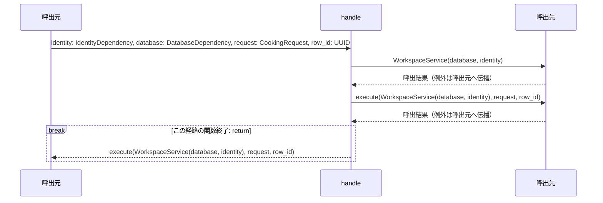
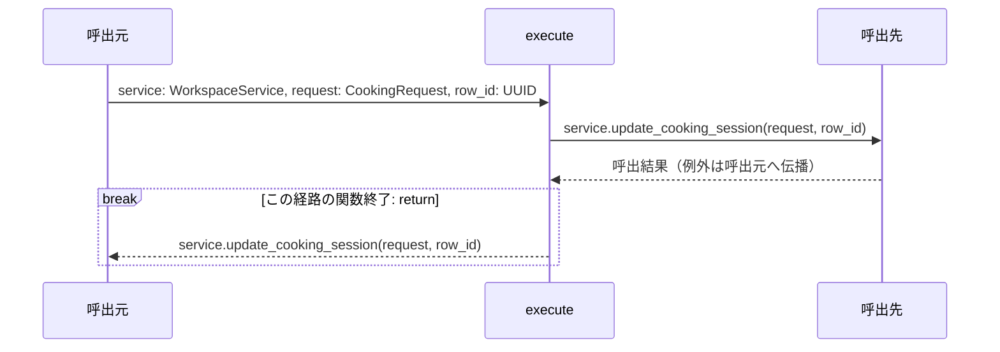
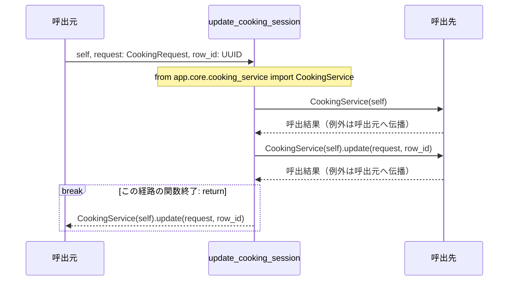
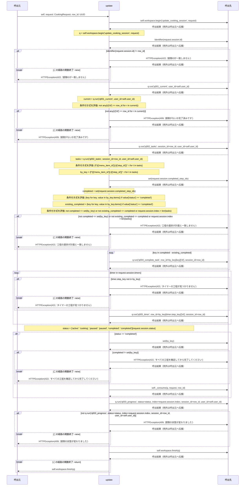

# シーケンス: update_cooking_session

[詳細](detail.md) / [入出力](interface.md) / [ログ](messages.md) / [SQL](queries.md) / [シーケンス](sequence.md) / [要因別試験](tests.md) / [API一覧](../../README.md)

実装から自動生成。手編集禁止。`uv run python tools/generate_service_design.py` で更新。

対象はrouter.py・functions.pyの各関数。呼出元・関数・呼出先の3者で、関数内の分岐と反復を示す。関数間を推測で展開せず、呼出先の名前をそのまま記載する。内包表記・短絡評価は条件付き式のまま残す。エンティティAPIは共有EntityServiceも含める。FastAPIの依存解決、middleware、DBドライバー内部はこの図の対象外。try/except/else/finallyとcontext境界を保持する。continue/breakは注記位置で該当経路を終了し、次の反復/ループ外へ進む。

### router.py: `handle`

定義元: `backend/src/app/apis/workspace/update_cooking_session/router.py:24`

### functions.py: `execute`

定義元: `backend/src/app/apis/workspace/update_cooking_session/functions.py:8`

### workspace_service.py: `update_cooking_session`

定義元: `backend/src/app/core/workspace_service.py:492`

### cooking_service.py: `update`

定義元: `backend/src/app/core/cooking_service.py:232`

### cooking_service.py: `_consume`

定義元: `backend/src/app/core/cooking_service.py:276`

```mermaid
sequenceDiagram
    participant Caller as 呼出元
    participant Function as _consume
    participant Callee as 呼出先
    Caller->>Function: self, q: Any, request: CookingRequest, session_id: UUID
    Function->>Callee: q.run(#39;q006_totals#39;, session_id=session_id)
    Callee-->>Function: 呼出結果（例外は呼出元へ伝播）
    Note over Function: totals = q.run(#39;q006_totals#39;, session_id=session_id)
    Note over Function: 条件付き式を評価: [(r.food_id, r.form, r.quantity.unit) for r in request.session.consumption_results]
    Note over Function: request_keys = [(r.food_id, r.form, r.quantity.unit) for r in request.session.consumption_results]
    Note over Function: 条件付き式を評価: [(str(r[#39;food_id#39;]), r[#39;form#39;], r[#39;unit#39;]) for r in totals]
    Note over Function: total_keys = [(str(r[#39;food_id#39;]), r[#39;form#39;], r[#39;unit#39;]) for r in totals]
    Function->>Callee: set(total_keys)
    Callee-->>Function: 呼出結果（例外は呼出元へ伝播）
    Function->>Callee: len(set(total_keys))
    Callee-->>Function: 呼出結果（例外は呼出元へ伝播）
    Function->>Callee: len(total_keys)
    Callee-->>Function: 呼出結果（例外は呼出元へ伝播）
    alt len(set(total_keys)) != len(total_keys)
        Function->>Callee: HTTPException(422, #39;同じ食材の複数商品・形態は個別の調理APIで指定してください#39;)
        Callee-->>Function: 呼出結果（例外は呼出元へ伝播）
        break この経路の関数終了: raise
            Function-->>Caller: HTTPException(422, #39;同じ食材の複数商品・形態は個別の調理APIで指定してください#39;)
        end
    end
    Function->>Callee: set(request_keys)
    Callee-->>Function: 呼出結果（例外は呼出元へ伝播）
    Function->>Callee: len(set(request_keys))
    Callee-->>Function: 呼出結果（例外は呼出元へ伝播）
    Function->>Callee: len(request_keys)
    Callee-->>Function: 呼出結果（例外は呼出元へ伝播）
    alt len(set(request_keys)) != len(request_keys)
        Function->>Callee: HTTPException(422, #39;同じ食材の使用量を重複して指定できません#39;)
        Callee-->>Function: 呼出結果（例外は呼出元へ伝播）
        break この経路の関数終了: raise
            Function-->>Caller: HTTPException(422, #39;同じ食材の使用量を重複して指定できません#39;)
        end
    end
    Note over Function: 条件付き式を評価: {(r.food_id, r.form, r.quantity.unit): r.quantity.value for r in request.session.consumption_results}
    Note over Function: requested = {(r.food_id, r.form, r.quantity.unit): r.quantity.value for r in request.session.consumption_results}
    Function->>Callee: set(total_keys)
    Callee-->>Function: 呼出結果（例外は呼出元へ伝播）
    Note over Function: allowed = set(total_keys)
    Function->>Callee: set(requested)
    Callee-->>Function: 呼出結果（例外は呼出元へ伝播）
    alt set(requested) - allowed
        Function->>Callee: HTTPException(422, #39;料理に含まれない食材や単位は使用量に指定できません#39;)
        Callee-->>Function: 呼出結果（例外は呼出元へ伝播）
        break この経路の関数終了: raise
            Function-->>Caller: HTTPException(422, #39;料理に含まれない食材や単位は使用量に指定できません#39;)
        end
    end
    Function->>Callee: defaultdict(Decimal)
    Callee-->>Function: 呼出結果（例外は呼出元へ伝播）
    Note over Function: ledger: dict[tuple[UUID, UUID], Decimal] = defaultdict(Decimal)
    loop total in totals
        Function->>Callee: str(total[#39;food_id#39;])
        Callee-->>Function: 呼出結果（例外は呼出元へ伝播）
        Note over Function: key = (str(total[#39;food_id#39;]), total[#39;form#39;], total[#39;unit#39;])
        Function->>Callee: requested.get(key, total[#39;required_amount#39;])
        Callee-->>Function: 呼出結果（例外は呼出元へ伝播）
        Note over Function: supplied = requested.get(key, total[#39;required_amount#39;])
        Note over Function: 条件付き式を評価: Decimal(str(supplied)) if supplied is not None else None
        Note over Function: amount = Decimal(str(supplied)) if supplied is not None else None
        Note over Function: outcome = #39;not_requested#39;
        alt request.deduct
            alt amount is None
                Note over Function: outcome = #39;unknown#39;
            else 条件が偽
                Function->>Callee: q.run(#39;q007_available#39;, user_id=self.user_id, form_id=total[#39;form_id#39;], unit_id=total[#39;unit_id#39;], product_id=total[#39;product_version_id#39;])
                Callee-->>Function: 呼出結果（例外は呼出元へ伝播）
                Note over Function: available = q.run(#39;q007_available#39;, user_id=self.user_id, form_id=total[#39;form_id#39;], unit_id=total[#39;unit_id#39;], product_id=total[#39;product_version_id#39;])
                Note over Function: 条件付き式を評価: sum((r[#39;amount#39;] for r in available), Decimal(0)) #60; amount
                alt sum((r[#39;amount#39;] for r in available), Decimal(0)) #60; amount
                    Note over Function: outcome = #39;insufficient#39;
                else 条件が偽
                    Note over Function: remaining = amount
                    loop lot in available
                        Function->>Callee: min(remaining, lot[#39;amount#39;])
                        Callee-->>Function: 呼出結果（例外は呼出元へ伝播）
                        Note over Function: used = min(remaining, lot[#39;amount#39;])
                        alt used #62; 0
                            Function->>Callee: q.run(#39;q008_consume#39;, lot_id=lot[#39;id#39;], user_id=self.user_id, amount=used)
                            Callee-->>Function: 呼出結果（例外は呼出元へ伝播）
                            Note over Function: ledger[lot[#39;id#39;], total[#39;unit_id#39;]] += used
                            Note over Function: remaining -= used
                        end
                        alt remaining == 0
                            Note over Function: 最内のループを終了する
                        end
                    end
                    Note over Function: outcome = #39;applied#39;
                end
            end
        end
        Function->>Callee: q.run(#39;q010_outcome#39;, total_id=total[#39;id#39;], session_id=session_id, amount=amount, outcome=outcome)
        Callee-->>Function: 呼出結果（例外は呼出元へ伝播）
    end
    Function->>Callee: ledger.items()
    Callee-->>Function: 呼出結果（例外は呼出元へ伝播）
    loop ((lot_id, unit_id), amount) in ledger.items()
        Function->>Callee: str(lot_id)
        Callee-->>Function: 呼出結果（例外は呼出元へ伝播）
        Function->>Callee: uuid5(session_id, #39;consume:#39; + str(lot_id))
        Callee-->>Function: 呼出結果（例外は呼出元へ伝播）
        Function->>Callee: q.run(#39;q009_ledger#39;, row_id=uuid5(session_id, #39;consume:#39; + str(lot_id)), user_id=self.user_id, session_id=session_id, lot_id=lot_id, amount=amount, unit_id=unit_id)
        Callee-->>Function: 呼出結果（例外は呼出元へ伝播）
    end
```

