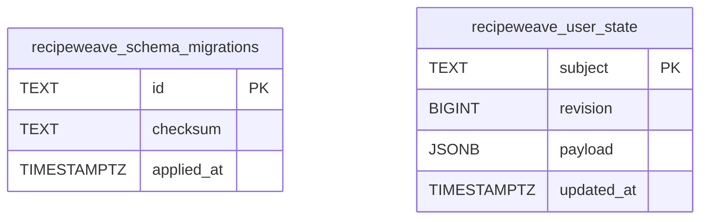

# 物理ER図

実装から自動生成。手編集禁止。`uv run python tools/generate_service_design.py` で更新。

```mermaid
erDiagram
    recipeweave_schema_migrations {
        TEXT id PK
        TEXT checksum
        TIMESTAMPTZ applied_at
    }
    recipeweave_user_state {
        TEXT subject PK
        BIGINT revision
        JSONB payload
        TIMESTAMPTZ updated_at
    }
```

現在のDDLには外部キーがないため、表同士を結ぶ線はない。payloadの論理構造はAPIモデル仕様を参照する。
