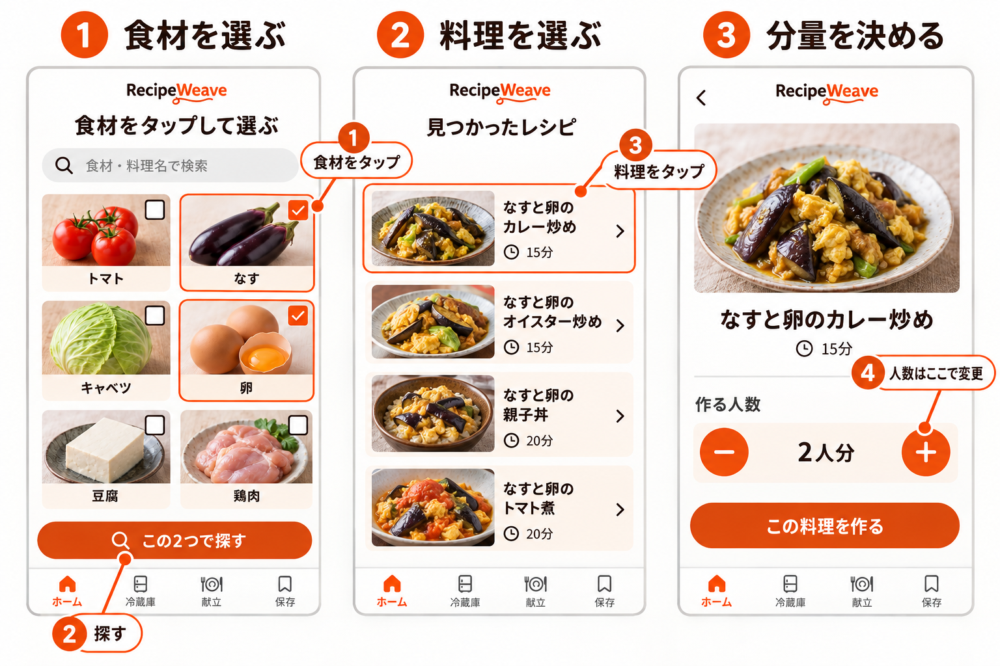
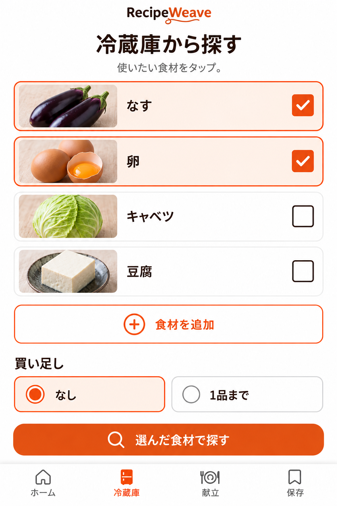
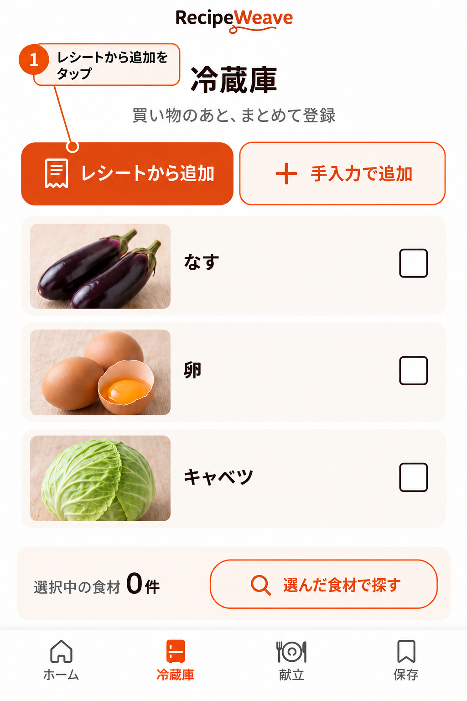
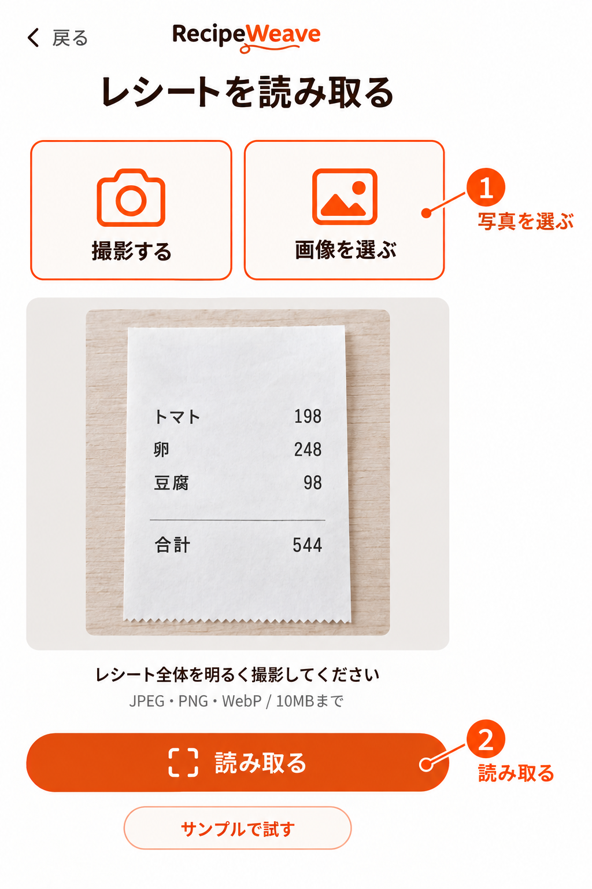
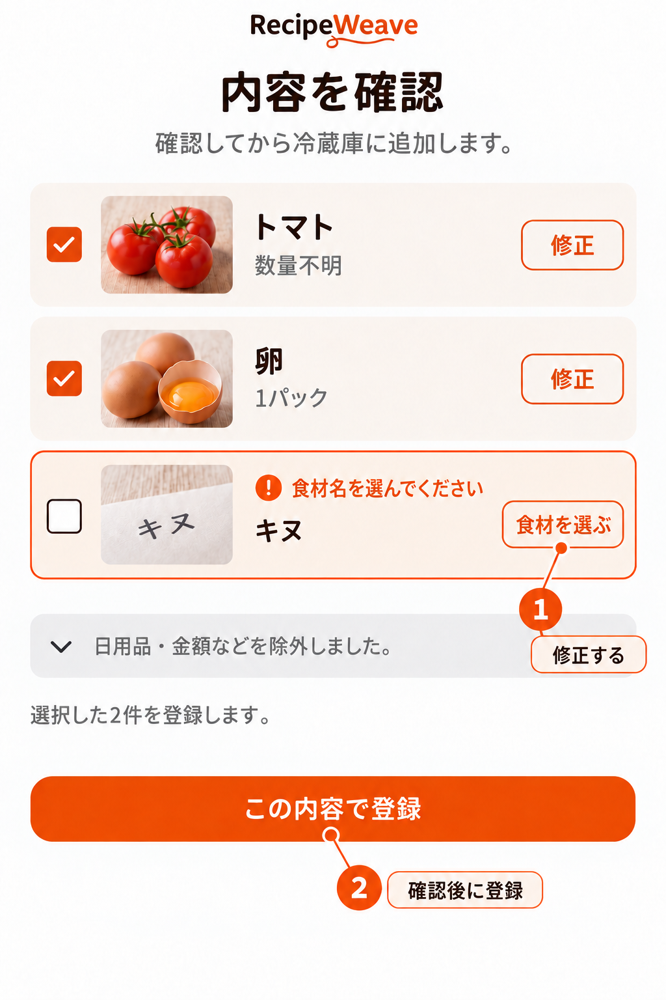
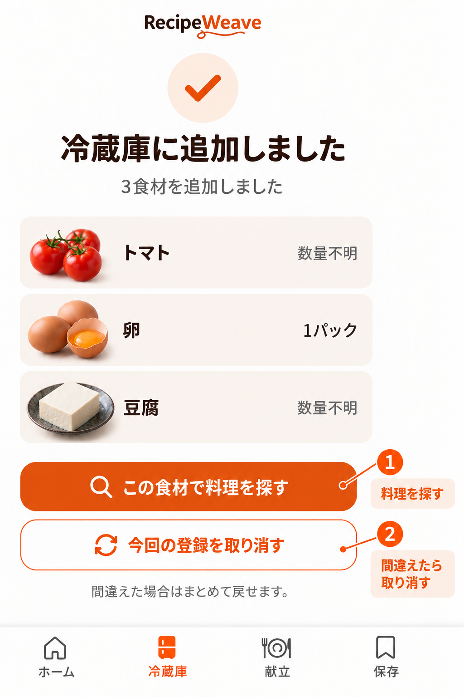
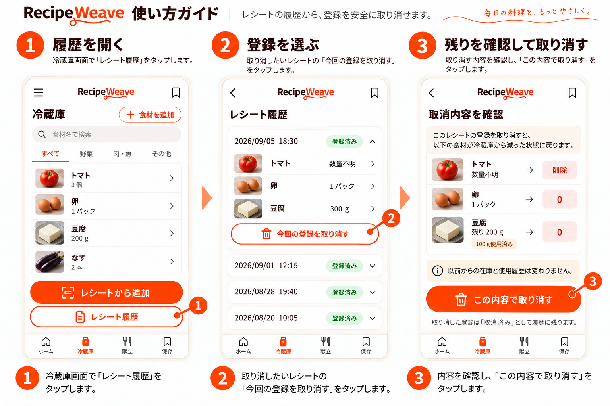
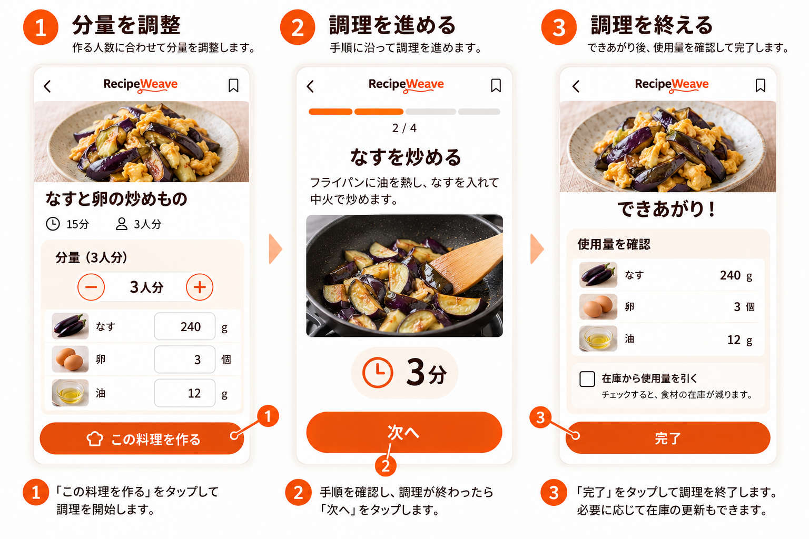
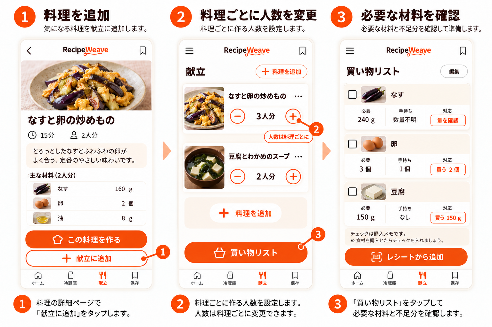

# RecipeWeave 利用者向けマニュアル

文書状態：Dev v0.1 利用者向けマニュアル。2026年9月6日現在、下記機能はPagesで試用公開中です。公開Chromeで基本操作を確認しています。スマートフォン実機や実レシートでの総合受入は未完了です。本文はこの版の操作を説明します。

## はじめに：試用版でできること

[RecipeWeaveの試用版を開く](https://tsuji-tomonori.github.io/RecipeWeave/)。サンプル料理8品で操作を試せます。提供範囲と未確認事項は次の表で確認してください。

| 機能 | 現在の提供状態 |
|---|---|
| 食材からの検索 | 下記8品のサンプルをPagesで試用公開中。人数・分量は料理を開いた後に変更 |
| レシートの画像読取 | 端末内での日本語読取をPagesで試用公開中。実ブラウザでの読取と実レシートの認識精度は未確認 |
| この端末での冷蔵庫・保存・献立 | ブラウザへの保存、データの書き出し・検証付き読込みをPagesで試用公開中 |
| 別端末への同期 | 今回の試用版では未提供。今後の機能として区別 |
| 献立・買い物・調理 | サンプル料理の人数変更、材料集計、段取り、調理再開、希望した場合の在庫減算をPagesで試用公開中 |
| 切り方ガイド・タイマー | 4種類の図と文章、終了時刻を保持するタイマーをPagesで試用公開中。動画と画面外の音通知は未提供 |

試用版のレシピや画像には操作確認用の見本が含まれます。画像は操作の案内であり、実画面のスクリーンショットではありません。この表と画面にある提供状態を先に確認してください。

収録した8品は、なすと卵の醤油炒め、なすと卵のカレー炒め、トマトと卵の炒めもの、豆腐とわかめのスープ、キャベツとツナの一品、カップ焼きそばのチーズアレンジ、ツナコーンごはん、きのこのバター炒めです。任意の食材の組み合わせに候補が見つかる範囲ではなく、操作を試すための料理です。

## まず料理を一品見つける

1. **① 食材の写真を押します。** 写真の右上にチェックが付きます。もう一度押すと外れます。小さなチェックだけでなく、カード全体を押せます。
2. 必要なら別の食材も押します。選択した食材は画面下で確認できます。
3. **②「この2つで探す」を押します。** 数字は選んだ食材の数で変わります。最初は、選んだ食材をすべて使う候補が出ます。
4. **③ 気になる料理を押します。** 材料と作り方が開きます。

検索前に人数や食材の量を入れる必要はありません。料理を開いた後で調整します。選び直したいときは「戻る」を押します。選んでいた食材を残したままホームに戻ります。

食材が見つからない場合は「食材をもっと見る」を押して、名前や種類から探します。冷凍品、惣菜、即席食品もここで選べます。

### おまかせで一品を見る

ホームの「偶然の一品」から料理を開けます。「別の一品」を押すと違う候補に変わります。食べられない食材の設定はここにも使われます。条件に合う候補がない場合は、そのことを表示し、設定を勝手に変えません。

## 冷蔵庫の食材から探す

1. **下の「冷蔵庫」を押します。** 冷蔵・冷凍・常温の食材を確認できます。
2. **今使いたい食材の行を押します。** 選択済みのチェックが付きます。
3. **「選んだ食材で探す」を押します。** 選んだ食材を使う料理が出ます。
4. 料理の「買い足し」「量を確認」も見てから、料理を開きます。

数量を入れていなくても検索できます。その場合は、手持ちの量だけで足りると決めつけず「量を確認」と表示します。常備調味料も確認対象です。

食材を先に使いたいときは、行内の「編集」を押して「優先して使う」を選びます。優先表示は期限が切れているという意味ではありません。行本体は検索に使う食材の選択、行内の「編集」は在庫の編集です。「編集」を押しても検索用の選択は変わりません。

## レシートから食材を登録する

### 1. 撮るか、画像を選ぶ

1. **図3aの① 冷蔵庫の「レシートから追加」を押します。**
2. **図3bの①「撮影する」または「画像を選ぶ」を押します。** 撮影が使えない端末では、端末で撮影した画像を選べます。
3. レシートの商品名と数量が読みやすいことを確認します。折れや反射で文字が隠れていれば撮り直します。
4. **図3bの②「読み取る」を押します。** 読み取り中は候補を準備しています。この時点では冷蔵庫へ登録しません。

選べる画像はJPEG・PNG・WebPで、1枚10MBまでです。HEICなど対応していない形式や容量超過は、その理由を表示して画像選択へ戻します。対応形式で保存し直すか、別の画像を選んでください。読み取りの途中でやめるときは「キャンセル」を押します。

画像の読み取りに失敗したら「もう一度読み取る」「画像を選び直す」「手入力で追加」から選べます。カメラの許可を断っても手入力と画像選択へ進めます。

> 操作だけ試したい場合は「サンプルで試す」を使います。実際のレシートを読んだ結果とは区別して表示します。

### 2. 候補の間違いだけを直す

1. 名前が不明な行は**図4の①「食材を選ぶ」を押します。** 読み取った原文と登録予定の食材を比べます。すでに食材名がある行を直す場合は「修正」を押します。
2. 名前が違うときは食材候補を選び直すか、名前を入力します。
3. **数量が分かる場合だけ量と単位を入れます。** 分からなければ「数量不明」のままで構いません。
4. 食品でない行や登録しない食品は、**チェックを外します。** 日用品・袋代・値引き・合計などは最初から登録対象外にします。判定に迷った行は確認対象として残します。
5. **「確認して戻る」を押します。** 候補一覧に戻り、訂正した内容とチェックを確認します。

食品なのに除外されていたら、**「除外した行」を開きます。** 図4では「日用品・金額などを除外しました。」と表示している部分です。対象の行の「食材として戻す」を押し、正しい食材を指定して「確認して戻る」を押すと、選択済みの登録候補へ戻せます。原文にもその行がない場合は、今回の登録を終えた後に「冷蔵庫 → 手入力で追加」で補います。

金額は量として使いません。「1パック」と分かっても、内容量が不明なら「1パック・内容量不明」と扱います。レシートに印字された購入個数と料理に使えるグラム数は別です。図4の卵「1パック」は実物の購入単位を確認して補った例で、図3bの価格「248」から作った値ではありません。

確認が必要な食材名が残る場合は、その行を直すか選択から外すと登録に進めます。図4では未確認の「キヌ」は未選択なので、選択済みの2件だけを登録できます。「キヌ」を「豆腐」に直して選ぶと3件になります。次の完了例では、この3件を登録しています。

同じ食品が複数行あっても、別に買ったものかもしれません。商品名が同じという理由だけでは行を消しません。

### 3. まとめて登録する

1. **画面下の「選択中 ○件」を確認します。** この件数だけが登録対象です。
2. **図4の②「この内容で登録」を一度押します。** 登録中は同じ操作を繰り返せないようにします。
3. 完了したら**図5aの①「この食材で料理を探す」を押します。** 登録した食材から料理を探せます。在庫を確認したい場合は下のナビゲーションの「冷蔵庫」を押します。

登録前にやめる場合は「キャンセル」を押します。訂正中なら破棄の確認を表示し、確認してやめた場合は在庫を変更しません。

同じレシートを再び読み取った可能性がある場合は「登録済みの可能性があります」と表示します。「履歴を見る」を押し、登録日時・食材一覧・登録済み／取消済みの状態を確認します。同じ買い物なら「登録をやめる」、別の買い物なら「別の買い物として登録」を選びます。判断できなければ登録をやめて在庫を確認できます。すべての重複を検出できるとは限らないため、似た内容を続けて読み込んだときも選択件数を確認してください。

### 4. 登録後に取り消す

図5bは、豆腐300gを登録し、100gを使った後の別の例です。図5aの数量不明だった豆腐から、量を推測して変更したものではありません。

1. 登録直後なら**図5aの②「今回の登録を取り消す」を押します。** 後からなら「冷蔵庫」を開き、**図5bの①「レシート履歴」を押します。**
2. 取り消したい登録を確認し、**図5bの②「今回の登録を取り消す」を押します。**
3. 追加した食材、現在残っている量、取り消し後の量を確認します。内容がよければ**図5bの③「この内容で取り消す」を押します。**

取り消すのは、そのレシートで追加し、まだ使っていない残量だけです。もともとあった在庫や、すでに使った履歴は残します。例えば以前の在庫100gとは別に300gを登録し、追加した分から100g使っていた場合は、その登録の残り200gだけを取り消します。

登録後に使用・編集した食材は「使用・編集済み：現在の残量を確認してください」と表示します。変更前後の内容と現在の残量を見てから確定してください。例えば今回の300gを250gへ編集していたら、表示された現在量250gが取り消し対象です。すでに使い切った・削除した分には減らす残量がありません。数量不明の行は不明の在庫項目を外し、数値の量を推測して差し引きません。

取り消した履歴は「取消済み」として残り、もう一度取り消すことはできません。取消済みのレシートを再登録したい場合は、同じ購入分が現在の在庫に残っていないことを確認して進めます。過去の消費や取消履歴は消えません。

## 手入力で食材を追加・修正する

1. 「冷蔵庫 → 手入力で追加」を押します。
2. 食材名を選びます。数量は分かる場合だけ入力します。
3. 必要なら保存場所や「優先して使う」を選びます。
4. 「登録する」を押します。

修正は冷蔵庫の各行にある独立した「編集」から行います。行本体を押す操作は検索用の選択であり、編集は開きません。0と数量不明は違います。数量が分からなくなった場合は「数量不明」に戻します。削除するときは対象を確認し、操作後の「取り消す」で戻せます。

## 条件を少しだけ変える

検索結果の「条件」を押すと、時間、買い足し、使う器具などを変更できます。人数と分量はここにありません。まずそのまま探し、必要な条件だけを変えてください。

- 「買い足しなし」を選んでも、在庫量が不明な食材があれば「量を確認」と表示します。
- 候補が0件なら、選んだ食材を外すか、買い足し・時間などを自分で変更します。
- 「食べられない食材」の設定は自動解除しません。
- 「選んだ食材をすべて使う」から「いずれかを使う」へ変えた場合は、結果にもその条件を表示します。

## 人数と材料の量を変える

1. 料理を開き、**材料の近くにある人数の「＋」「−」を押します。** 数字を押して直接入力することもできます。
2. 材料の量が変わったことを確認します。
3. 特定の材料だけ変えたい場合は、**その材料の数量欄を押して直接入力します。**
4. 一品を作るなら**図6の①「この料理を作る」を押します。** 献立に入れる場合は「献立に追加」を押します。どちらも調整した分量を引き継ぎます。

人数を変えても加熱時間は単純に倍にはしません。材料を個別に変えた状態には「調整済み」と表示します。さらに人数を変える場合は、直前に確定した分量を人数比で調整し、更新後の量を確認できます。「元の分量に戻す」で料理の標準分量へ戻せます。

同じ食材を使う別の味を見たいときは「アレンジ」を押します。味付け・追加食材・調理法の違いを比べて料理を選びます。

## 料理を保存する

1. 料理詳細の「保存」を押します。「保存済み」に変わります。
2. 下の「保存」から料理を開けます。
3. 保存を外す場合は「保存済み」をもう一度押します。間違えたら直後の「取り消す」を押します。

「保存」は料理を後で開くためのしおりです。分量のセットを保存する操作ではありません。人数や材料量の調整は、このブラウザの料理詳細の下書きとして別に維持するので、同じブラウザで開き直すと調整した量が見えます。「元の分量に戻す」で標準分量へ戻せます。調整した量は献立や調理にも引き継ぎます。

料理を保存しただけでは献立や在庫は変わりません。保存した料理が公開終了した場合は、料理を開けない理由を表示します。

## 献立と買い物をまとめる

1. 料理詳細で**図7の①「献立に追加」を押します。**
2. 献立画面で**図7の② 各料理の人数の「＋」「−」を押します。** 主菜だけ3人分、副菜を2人分のように変えられます。数字を押して直接入力することもできます。別の料理の人数は変わりません。
3. 別の料理を入れるときは**「料理を追加」を押します。**
4. **図7の③「買い物リスト」を押します。** 必要な材料がまとめて表示されます。

「必要量」「手持ち」「買う量」は分けて表示します。図7では、なすは必要240g・手持ち数量不明なので「量を確認」、卵は必要3個・手持ち1個なので「買う2個」、豆腐は必要150g・手持ちなしなので「買う150g」です。数量不明は不足分が0だとは扱いません。個数からグラムへの換算が分からないものも、そのまま確認できます。

買ったものは行を押してチェックできます。間違えたら同じ行をもう一度押すと外れます。チェックは買い物中のメモで、付け外しだけでは在庫は変わりません。在庫へ追加するには、買い物後にレシートから登録するか、実際に買った量を確認して手入力します。どちらかで登録したら、同じ購入をもう一度追加しないよう履歴を確認できます。

人数や献立を変えて必要量が変わった項目は、購入チェックを外して再確認できるようにします。献立から料理を外した場合は、買い物リストと段取りも更新します。リストから外れた購入済みの項目は「以前の購入メモ」に分け、現在必要な項目と区別します。

## 手順を見ながら料理する

図6の中央が調理中、右側が調理完了の画面です。

1. 一品だけなら料理詳細の**図6の①「この料理を作る」を押します。** 献立なら「段取りを見る」を押します。
2. 献立では使う器具と作業の順番を確認し、**「調理を始める」を押します。**
3. 大きく表示された工程を確認して進めます。終わったら**図6の②「次へ」を押します。**
4. 切り方が分からなければ**「切り方を見る」を押します。** ガイドを閉じると元の工程へ戻ります。

途中で止める場合は「中断」を押します。ホーム上部、または献立に表示される「調理を再開」で、料理名と工程番号を確認して押すと続きが開きます。「次へ」を押しすぎたら「戻る」で前の工程へ戻れます。戻る操作では在庫は変わりません。完了済みの工程と起動済みのタイマーを維持し、同じタイマーを勝手に重複起動しません。

この版の切り方ガイドは、半月切り・くし形切り・角切り・ざく切りの図と文章です。動画はありません。「元の工程に戻る」で調理へ戻ります。

タイマーは各工程の「○分のタイマーを始める」を押すと動きます。画面を閉じても終了時刻を保持し、再開すると残り時間を表示します。終了時刻を過ぎていれば「時間になりました」と表示します。音の通知はありません。実際の端末で画面を閉じた場合の動作は未確認です。

最後の工程を終えると、図6の右側の画面が開きます。実際に使った量を確認し、違う量を使った材料は使用量を直します。

**「在庫から使用量を引く」は最初はチェックなしです。** 在庫を変えずに終えるなら、そのまま**図6の③「完了」を押します。** 在庫を更新したい場合だけチェックを付け、減らす量を確認して「完了」を押します。

減らせるのは、使用量と同じ単位で登録され、必要な量が足りている在庫だけです。数量不明・不足・換算できない材料は、それぞれ理由を表示し、減らしません。結果画面で反映した食材と見送った食材を確認できます。同じ完了を繰り返して二重に減らすことはありません。

## 好み・保存先・ヘルプ

ホームの「設定」から、食べられない食材、常備調味料、使う器具を登録できます。設定済みの除外食材は、検索と偶然の一品の両方で使います。

試用版はこの端末の、このブラウザに保存します。自動同期は提供しないため、別端末へ移す場合は次のように操作します。

1. **「設定 → データを書き出す」を押し、ファイルを保存します。**
2. 移動先で**「設定 → データを読み込む」を押し、そのファイルを選びます。**
3. 内容の件数と置換対象を確認してから確定します。**読み込むと、現在のブラウザのデータをファイルの内容へ置き換えます。** 追加で合算する操作ではありません。必要なら先に移動先のデータも書き出してください。

壊れているなど読み込めないファイルは反映せず、現在のデータを残します。ブラウザのデータを消した後にバックアップがない場合、サービス側から復元することはできません。

「保存データを開けません」と表示された場合は、**「設定からバックアップを復元 → データを読み込む」を押し、正常なバックアップを選びます。** 件数と置換対象を確認し、「この内容で置き換える」で確定します。確認後に別のタブでデータが変わった場合は、復旧を中止して再読込みを案内します。正常に開けるデータには通常の読込み手順を使います。「この保存データは異なる版です」と出たデータを、破損とみなして強制的に上書きすることはできません。

保存に必要な Web Locks を使えないブラウザでは、閲覧と正常なデータの書き出しのみ利用できます。登録・変更・読込みは保存できないため、対応する最新版のブラウザで開いてください。保存できなかったときはエラーを表示し、完了として扱いません。

レシート画像はこの端末で読み取り、サービスのサーバーへ送信しません。画像と読み取った全文は、その場の確認だけに使い、在庫の登録・キャンセル・画面を閉じたときに破棄します。店舗名やレシート上の購入日時も保存しません。

このブラウザに残すのは、選んだ食材・数量・単位、登録日時、登録の区別・重複確認・取消に必要な履歴です。元の画像や全文を復元できる形では残しません。履歴から元のレシート画像を開くことはできません。アプリ内での破棄は、画像選択前から端末にあった写真を削除する操作ではありません。

端末のデータを消す前には、書き出したファイルを保存してあることを確認します。書き出したファイルには冷蔵庫や保存した料理などの利用データが含まれるので、渡す相手を確認してください。

困ったときは「設定 → 使い方・Q&A」を開きます。読み取り失敗や数量不明でも、手入力や確認待ちの状態から続けられます。
