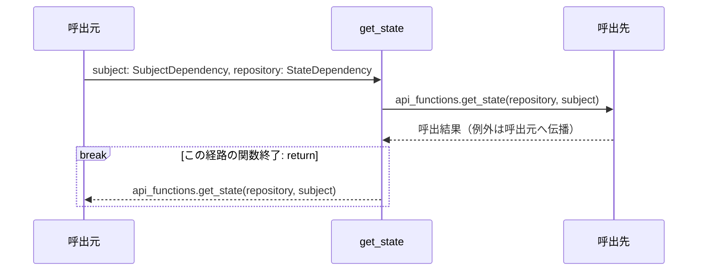
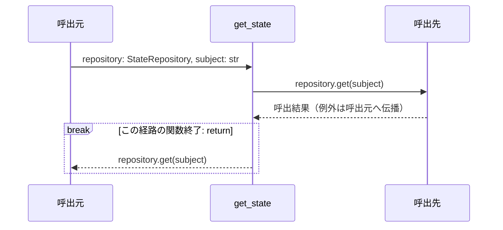

実装から自動生成。手編集禁止。`uv run python tools/generate_service_design.py` で更新。

対象はrouter.py・functions.pyの各関数。呼出元・関数・呼出先の3者で、関数内の分岐と反復を示す。関数間を推測で展開せず、呼出先の名前をそのまま記載する。内包表記・短絡評価は条件付き式のまま残す。FastAPIの依存解決、middleware、連携ポートの実装内部はこの図の対象外で、詳細設計と定義元を参照する。continue/breakは注記位置で該当経路を終了し、次の反復/ループ外へ進む。

### router.py: `get_state`

定義元: `backend/src/app/apis/state/get_state/router.py:21`



#### 対応する実装

```python
@router.get(CONTRACT.path, operation_id=CONTRACT.operation_id, summary=CONTRACT.summary, responses={401: {'description': '有効なアクセストークンが必要'}, 503: {'description': '同期を利用できない'}})
def get_state(subject: SubjectDependency, repository: StateDependency) -> StateEnvelope:
    return api_functions.get_state(repository, subject)
```

### functions.py: `get_state`

定義元: `backend/src/app/apis/state/get_state/functions.py:5`



#### 対応する実装

```python
def get_state(repository: StateRepository, subject: str) -> StateEnvelope:
    """認証済み本人の状態だけを読む。呼出側が他の利用者識別子を選ぶことはできない。"""
    return repository.get(subject)
```
